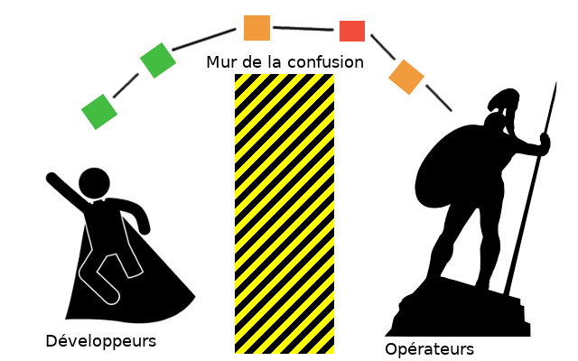

# Description  DevOps

Depuis environ 3 ans le terme **devops** est arrivé dans le langage des gestionnaires, si nous regardons les offres d'emplois, on voit que même les banques ont emboité le pas. Bon c'est bien beau, mais comme bien souvent le terme est mal compris ou mal employé, nous allons essayé de clarifier le concept. 

Comme j'ai dit ceci est un concept donc est sujet à interprétation, ce n'est pas une recette a appliquer bêtement mais une méthode de travail. Il faut l'adapter à votre environnement , votre réalité tous en gardant les principes de base. Afin de comprendre le concept nous allons partir de l'histoire qui a amené les organisations à considérer ce mode de travail. 

# Du mode classique à la méthode DevOps

Je pense que si nous comprenons le cheminement du changement de méthode, ceci simplifiera grandement à comprendre l'essence du concept.

Donc dans un temps pas si loin que ça l'ensemble du développement était réalisé en mode [**cascade**](https://fr.wikipedia.org/wiki/Cycle_de_d%C3%A9veloppement_(logiciel)#Mod.C3.A8le_en_cascade)  ou [**warterfall**](https://en.wikipedia.org/wiki/Waterfall_model) en anglais. 

Afin de m'assurer que l'on est tous sur la même longueur rapide clarification sur le mode en cascade, une petite image et on développe dessus 

L'idée de ce mode de développement est de :

1. Définir l'ensemble des requis applicatif en fait l'ensemble de l'application 
2. Suite à cette définir réalisation de l'architecture 
3. Réalisation du programme, peu de changement devrons avoir lieu, car l'ensemble des requis furent définie à l'étape 1. Dans la réalité les demandes de changement arrivent et retarde la livraison :P.
4. Validation 
5. Déploiement et maintenance applicatif 

Ceci est en opposition avec le mode [**agile**](https://fr.wikipedia.org/wiki/M%C3%A9thode_agile) qui se veut un développement itératif . De nos jour ce mode de développement est le plus courant dans l'industrie .

Les méthodes agiles prônent 4 valeurs fondamentales :

* Individus et interactions plutôt que processus et outils
* Fonctionnalités opérationnelles plutôt que documentation exhaustive
* Collaboration avec le client plutôt que contractualisation des relations
* Acceptation du changement plutôt que conformité aux plans

Pourquoi le mode **agile** à pris de l'ampleur ? Premièrement parce que le __client__ ou __demandeur__ est impliqué dans le développement dans les décisions des prochaines fonctionnalité à mettre en place. Tous le monde aime être impliqué :P , en plus de choisir les prochaines fonctionnalité il peut voir l'évolution et comprendre les problématiques rencontré. Dans le mode **cascade** il attend un certain nombre de mois avant de voir un résultat. Cette inclusion du client fait aussi en sorte que grâce à ce dialogue s'il change d'avis, désolé, quand il change d'avis ceci sera dans a prochaine itération. Comme il y a régulièrement des livrables avec cette méthodes l'application peut être déployé , mise en production et continuer son évolution !! Le dernier point est important, car comme la concurrence est forte sur l'ensemble des services offert sur internet les nouvelles fonctionnalité doivent arrivées régulièrement pour sustenter le client / utilisateurs. 
Résultat nous aurons beaucoup plus de livraison : version 1.0 , 1.1 , 1.2 à 1.8 puis la version 2 , 2.1 à 2.5 , peut-être dans des délais cours

Si nous revenons à la méthode **cascade** en comparaison , avec le mode **agile** l'idée est de livrer des fonctionnalités plus rapidement qui seront mis en production ! 

Ce changement de mode de travail des développeurs sera un des premiers tournant qui apportera le mouvement **DevOps** ! Car maintenant le nombre de mise à jour applicatif explose, l'équipe d'opération doit mettre en place régulièrement les nouvelles version et bien entendu les patchs qui en découle suite à la détection de problème en production. 

## Développeurs Vs Opérateurs

La situation sur la champs de bataille est donc la suivante :

* Le Développeur qui se prend pour un super Héros, il désire pousser ces fonctionnalités "SANS BUGS" qu'il a développé  ( et oui j'étais un Opérateur :P ) 

* L'opérateur qui se prend pour le gardien de la sécurité et de la stabilité de l'application, il protège la compagnie, contre les aberrations du devs !!

Faut dire que souvent l'opérateur est sur appel la nuit et les week-ends il a tous intérêt à s'assurer de la stabilité s'il veut pas être réveille en pleine nuit ou pendant un match de foot :P.

Résultat voici une représentation de l'état des relations entre les 2 équipes :

Si en plus votre organisation est de taille moyenne et que les 2 équipes ne sont pas physiquement proche, les frustrations sont nombreuses et les critiques entre les 2 équipes sont nombreuses . Bien entendu ceci est dû à une incompréhension des 2 réalités.

Résultat , l'opérateur est un gros méchant qui bloque l'innovation des développeurs, à tord ou à raison peu importe , le problème est que souvent le développement fut réalisé et il ne passe pas l'étape du déploiement et l'opérateur oblige des correctifs mineur ou majeur selon la situation. Comme le développement est en mode Agile l'impact est moindre, mais génère des retards sur la livraison .

ICI ICI ICI 
