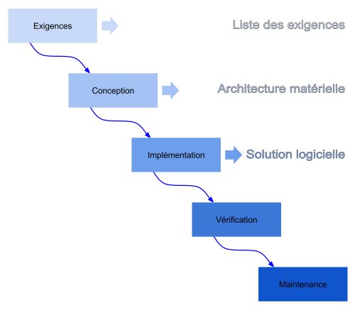
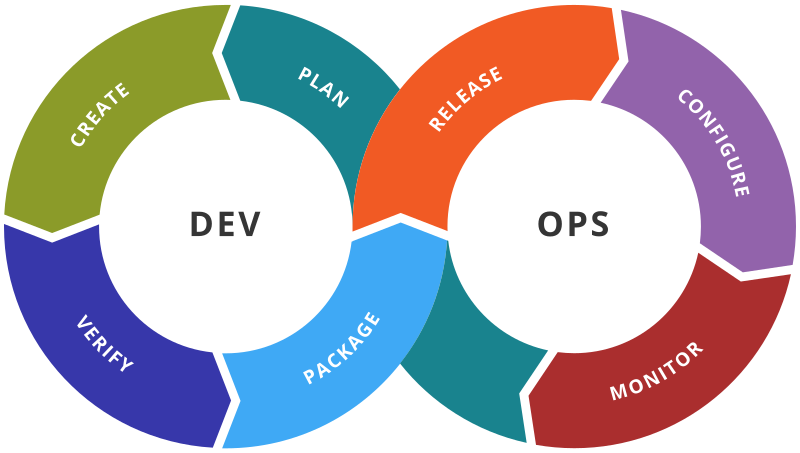
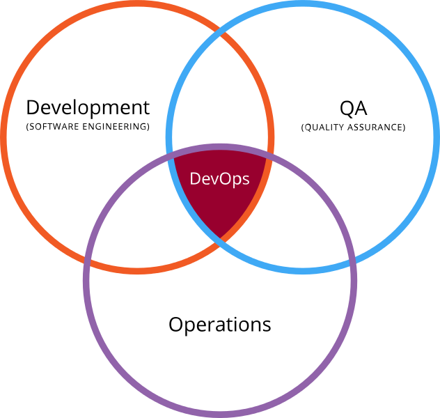

# Présentation de DevOps

Depuis environ 3 ans le terme **devops** est arrivé dans le langage des gestionnaires, si nous regardons les offres d'emplois, on voit que même les banques ont emboité le pas. Bon c'est bien beau, mais comme bien souvent le terme est mal compris ou mal employé, nous allons essayé de clarifier le concept. 

Comme j'ai dit ceci est un concept donc est sujet à interprétation, ce n'est pas une recette a appliquer bêtement mais une méthode de travail. Il faut l'adapter à votre environnement , votre réalité tous en gardant les principes de base. Afin de comprendre le concept nous allons partir de l'histoire qui a amené les organisations à considérer ce mode de travail. 

# Du mode classique à la méthode DevOps

Je pense que si nous comprenons le cheminement du changement de méthode, ceci simplifiera grandement à comprendre l'essence du concept.

Donc dans un temps pas si loin que ça l'ensemble du développement était réalisé en mode [**cascade**](https://fr.wikipedia.org/wiki/Cycle_de_d%C3%A9veloppement_(logiciel)#Mod.C3.A8le_en_cascade)  ou [**warterfall**](https://en.wikipedia.org/wiki/Waterfall_model) en anglais. 

Afin de m'assurer que l'on est tous sur la même longueur rapide clarification sur le mode en cascade, une petite image et on développe dessus 

L'idée de ce mode de développement est de :

1. Définir l'ensemble des requis applicatif en fait l'ensemble de l'application 
2. Suite à cette définir réalisation de l'architecture 
3. Réalisation du programme, peu de changement devrons avoir lieu, car l'ensemble des requis furent définie à l'étape 1. Dans la réalité les demandes de changement arrivent et retarde la livraison :P.
4. Validation 
5. Déploiement et maintenance applicatif 

Ceci est en opposition avec le mode [**agile**](https://fr.wikipedia.org/wiki/M%C3%A9thode_agile) qui se veut un développement itératif . De nos jour ce mode de développement est le plus courant dans l'industrie .

Les méthodes agiles prônent 4 valeurs fondamentales :

* Individus et interactions plutôt que processus et outils
* Fonctionnalités opérationnelles plutôt que documentation exhaustive
* Collaboration avec le client plutôt que contractualisation des relations
* Acceptation du changement plutôt que conformité aux plans

Pourquoi le mode **agile** à pris de l'ampleur ? Premièrement parce que le __client__ ou __demandeur__ est impliqué dans le développement dans les décisions des prochaines fonctionnalité à mettre en place. Tous le monde aime être impliqué :P , en plus de choisir les prochaines fonctionnalité il peut voir l'évolution et comprendre les problématiques rencontré. Dans le mode **cascade** il attend un certain nombre de mois avant de voir un résultat. Cette inclusion du client fait aussi en sorte que grâce à ce dialogue s'il change d'avis, désolé, quand il change d'avis ceci sera dans a prochaine itération. Comme il y a régulièrement des livrables avec cette méthodes l'application peut être déployé , mise en production et continuer son évolution !! Le dernier point est important, car comme la concurrence est forte sur l'ensemble des services offert sur internet les nouvelles fonctionnalité doivent arrivées régulièrement pour sustenter le client / utilisateurs. 
Résultat nous aurons beaucoup plus de livraison : version 1.0 , 1.1 , 1.2 à 1.8 puis la version 2 , 2.1 à 2.5 , peut-être dans des délais cours

Si nous revenons à la méthode **cascade** en comparaison , avec le mode **agile** l'idée est de livrer des fonctionnalités plus rapidement qui seront mis en production ! 

Ce changement de mode de travail des développeurs sera un des premiers tournant qui apportera le mouvement **DevOps** ! Car maintenant le nombre de mise à jour applicatif explose, l'équipe d'opération doit mettre en place régulièrement les nouvelles version et bien entendu les patchs qui en découle suite à la détection de problème en production. 

## Développeurs Vs Opérateurs

La situation sur la champs de bataille est donc la suivante :

* Le Développeur qui se prend pour un super Héros, il désire pousser ces fonctionnalités "SANS BUGS" qu'il a développé  ( et oui j'étais un Opérateur :P ) 

* L'opérateur qui se prend pour le gardien de la sécurité et de la stabilité de l'application, il protège la compagnie, contre les aberrations du devs !!

Faut dire que souvent l'opérateur est sur appel la nuit et les week-ends il a tous intérêt à s'assurer de la stabilité s'il veut pas être réveille en pleine nuit ou pendant un match de foot :P.

Résultat voici une représentation de l'état des relations entre les 2 équipes :

Si en plus votre organisation est de taille moyenne et que les 2 équipes ne sont pas physiquement proche, les frustrations sont nombreuses et les critiques entre les 2 équipes sont nombreuses . Bien entendu ceci est dû à une incompréhension des 2 réalités.

Résultat , l'opérateur est un gros méchant qui bloque l'innovation des développeurs, à tord ou à raison peu importe , le problème est que souvent le développement fut réalisé et il ne passe pas l'étape du déploiement et l'opérateur oblige des correctifs mineur ou majeur selon la situation. Comme le développement est en mode Agile l'impact est moindre, mais génère des retards sur la livraison .

Nous constatons donc un changement au niveau du développement mais pas dans l'ensemble de la chaine de production résultat le gain n'est pas optimal !

Ce changement organisationnel arrive avec le mode **DevOps**

# La solution le mode DevOps 

Maintenant que nous avons vu le cheminement qui à précédé l'arrivée du **DevOps** ceci sera plus simple à comprendre. L'objectif principale et de détruire le **mur de la confusion** ou **mur de l'incompréhension**. En d'autre mot unir les Développeurs et les Opérateurs, aille ça ressemble au terme **DevOps** d'un seul coup :P.

Reprenons les critères principaux des Devs et des Ops, ils sont tous très légitime  :

* Développeurs :
    * Développer :P 
    * Innover et voir ces innovations en production.
    * NE PAS S'occuper du déploiement , de l'OS et tous le tralala ... 
    * Ne PAS être bloquer dans les choix des technologies. 
* Opérateurs :
    * Avoir une stabilité de l'application en production.
    * Ne pas avoir des technologies ingérable ou difficilement contrôlable.
    * Une simplification des déploiements , surtout s'il y a régulièrement des déploiements.

Le mouvement **DevOps**, va donc permettre une inclusion des opérateurs très tôt dans le développement , augmentant le dialogue entre les 2 parties. Après tous nous sommes tous dans la même compagnie, si le développement prospère et que les opérations prospère aussi la compagnie "devrait" être aussi prospère.

Voici une image de la chaine des relations du **DevOps**, nous allons voir un peu les différents élément composant cette chaine.

J'aimerai clarifier un point **IMPORTANT**, nous avons 2 partie sur l'image , mais **L'ÉQUIPE** est composé de membre avec des compétences plus grande en développement ou en opération. Donc si nous prenons la partie création , les opérations seront ou plutôt doivent être impliqué et y participé. Au même titre que les développeurs doivent être impliqué lors de la configuration des environnements afin de procéder au validation des déploiements.

## Étape de la chaine DevOps

Prenons les différents point de l'images ci-dessous et regardons ce que ceci indique plus que le simple mot [Étape de la chaine DevOps](https://en.wikipedia.org/wiki/DevOps_toolchain). Faut y mettre un grain de sel dans tous ça , ici nous parlons de grand principe dans la pratique il y a toujours de ajustement et des éléments que l'on fait moins.

### Plan ou définition 

Bien entendu que nous soyons en mode **Agile** ou **Cascade** l'étape d'analyse reste essentiel , nous la retrouvons ici. Par contre l'analyse doit inclure les opérateurs. En plus de l'analyse des technologies et des requis de fonctionnalité applicatif il est important de définir :

* Les métriques de production qui seront jugé acceptable ( ex: quelles est la temps d'affichage acceptable ? , le temps de rafraichissement des données ? ...) .
* Les critères de sécurité, les conformités , ...
* Le processus de mise à jour applicatif ET base de donnée.
* Les métriques qui seront généré par l'application.
* Les testes de monitoring applicatif.

### Création  (Create) 

Le processus de création est donc principalement au niveau du développement , cependant telle que mentionné lors de la présentation de l'image ceci doit être réaliser avec l'ensemble de l'équipe (**devops**).

La création comprend :

* Le désigne de l'application.
* La partie développement (**CODE**) , ceci comprend des testes unitaire et idéalement de performance.
* Compilation applicatif et réalisation des testes de performances.
* Réalisation de [Release candidat](https://en.wikipedia.org/wiki/Software_release_life_cycle#Release_candidate)

### Vérification (Verify) 

Ceci est surtout pour l'équipe de l'assurance qualité , mais pas uniquement il est les testes fonctionnel et les validations du code.

La vérification comprend :

* Testes applicatif.
* Testes de régression .
* Analyse de sécurité , et idéalement teste d'intrusion.
* Validation de la configuration. 

### Préparation d'un tout cohérent (Package / stating ) 

Désolé pour le titre j'ai eu quelque difficulté à trouver un terme Français pour __packaging__ , l'idée générale de cette étape et de faire l'ensemble des tâche requis en vue de la version finale de l'application , la **release** .

* Recherche des approbations ou pré approbation.
* Packaging des configurations.
* Déploiement sur les environnements Dev -> QA -> Preprod (staging release).
* Mise en place des artefacts applicatif dans une voûte.

### Livraison version "finale" (Release)

Nous sommes donc à l'étape de la livraison d'une version de l'application, nous avons plusieurs étapes :

* Coordination de la livraison ( Play By Play ).
* Déploiement et activation des fonctionnalités en production .
* Plan d'action en cas de retour arrière .
* Planification de l'indisponibilité de l'application si requis.

### Configuration (Configure)

Cette étape comprend l'ensemble du processus de configuration :

* Configuration de l'infrastructure de stockage , les bases de données , l'infrastructure réseaux
* Configuration du système d'exploitation pour répondre au requis applicatif ( ex: limite de fichier ouvert , ...)
* Configuration de l'application en lien avec son environnement

### Monitoring (Monitor)

Malheureusement cette partie fut sous réalisé dans les années passé, dans le monitoring nous ne parlons pas uniquement de s'assurer que l'application est disponible en validant la disponibilité du port réseau. Il est important aussi d'avoir des métriques afin de savoir si l'application est "performante" et utilisable.

* Collecte de métrique sur les performances de l'infrastructure TI.
* Collecte d'information sur l'expérience de l'utilisateur.
* Statistique de l'application dans le temps.

### Conclusion de cette chaine 

Au risque de me répéter, j'aimerai rappeler que les opérateurs et les développeurs sont dans la même équipe, donc les tâches sont commune à l'ensemble de l'équipe et doivent être planifié comme telle.

Une autre forme de chaine est apparue en 2014 avec cette suite :  __Plan, Code, Build, Test, Release, Deploy, Operate et Monitor__. Mon objectif ici est était surtout de montrer 2 points :

* La boucle infinie dans le développement , le déploiement et le monitoring
* La relation d'unité dans l'équipe avec 2 champs de compétence complémentaire
* Les étapes haut niveau du cycle.

Bien entendu dans votre réalité vous pouvez voir l'association de votre développement pour chaque partie, nous allons maintenant voir les grands principes du **DevOps** ce que nous allons mettre en place afin d'être en mesure de suivre la cadence de ce développement perpétuel.

## Les principes ESSENTIEL 

Nous avons vue le cycle de la chaine du développement en mode **DevOps** maintenant nous nous attarderons au principe pour y arrivé. Nous allons parler d'automatisation de processus dans le but de suite le rythme imposé par cette boucle infinie du développement.

Commençons avec but , le **Graal** :P .

* Augmentation de la fréquence des déploiements.
* Fonctionnalité plus rapidement mis en production donc sur le marché.
* Réduire le nombre d'erreur ou problème lors de la mise en place de la nouvelle version.
* Réduire le temps entre les correctifs
* En cas de problème réduire le temps de recouvrement 

Résultat de la mise en place du **DevOps** :

* Meilleur prédiction de la suite.
* Augmentation de l'efficacité.
* Amélioration de la maintenance opérationnel, car plus confortable avec le changement.
* Mise en place de tâches en libre service pour l'équipe.

C'est partie pour le détail pour y arriver 

### Collaboration

Oui, je vais encore le répéter :P , la collaboration entre les gens, car au final c'est les hommes qui font le travail et qui réussissent de grande chose. Je ne sais pas qui a dit ça à l'origine, mais ce fut mentionné dans un emploie passé 

> Tous seul on va plus vite, mais ensemble on va plus loin !! 

J'aime bien cette citation , elle représente bien le travail collaboratif .

Donc l'ensemble des personnes doivent être unis dans le but et travailler ensemble , voici une autre représentation de cette unité :

Nous sommes interconnecter, quand le développeur à des questions sur l'infrastructure il questionne l'équipe TI / Opérateur. Lorsque l'équipe de l'assurance qualité rencontre une problématique applicative il consulte le développeur et / ou l'équipe d'opération . Lorsqu'il y a un problème applicatif avec l'application que l'infrastructure ne semble pas en cause l'opérateur consulte le développeur pour avoir plus d'information. En d'autre mot nous sommes lié ensemble autour du produit. 

Nous ne voulons plus entendre : c'est la faute du Dev ou de l'installation , mais est-ce possible de me fournir cette information pour que je puisse analyser la situation .

### Automatisation 

L'automatisation est au centre du travail du DevOps, car la charge de travail qu'on lui demande est grande. Avec le nouveau mode de travail nous désirons qu'il y est plus d'intégration de l'application , plus de teste , plus de validation , plus de déploiement , plus de surveillance .
Bien entendu il est toujours possible de réaliser ces opérations manuellement mais rapidement les  personnes n'auront plus d'intérêt et la productivité sera impacté. 

Nous retrouverons donc souvent dans les équipes de **devops** une boite à outils qu'ils furent développé à l'interne, acheter ou l'utilisation de logiciel libre. Bien entendu, la majorité du temps c'est un mixe de l'ensemble.

Je dirai même que l'objectif est d'automatiser au maximum , ceci aura l'avantage :

* De réduire les erreurs humaines
* De permettre de réaliser  à l'identique les opérations (Reproductible)
* D'augmenter le temps de réalisation des tâches (Productivité)
* Éventuellement permettre à n'importe qui d'exécuter l'opération librement sans votre assistance (Self-Service)

Si vous avez peur de plus avoir de travail, pas de panique on arrive jamais à tous automatisé et on trouve toujours plus de chose à faire quand on a du temps :P.

### Intégration continue 

Intégration régulière / continue du travail des personnes de l'équipe. Nous partons du principe que l'équipe utilise un système de contrôle de révision telle que **Subversion** , **git** afin de mettre leur travaille ensemble. Ceci n'est techniquement peut-être pas requis cependant de mon point de vue il est essentiel pour simplifier le retour arrière , ainsi que les requêtes de fusion (merge) .

L'objectif de cette étape et de voir **rapidement** s'il y a un problème d'intégration et de pouvoir l'adresser **rapidement** (au risque de me répéter :P ).

#### Concrètement un cas pratique 1.

L'équipe travaille sur une application 3 tiers ( frontale Web, Application __backend__ , Base de donnée ) .

Un développeur pris par un excès de zèle décide de réalise de la documentation dans le code , __yep__ ça arrive parfois  :P . Remplie de confiance il pousse la modification du code sans compilation, car il a rien touche , selon son point de vue. Grâce à l'intégration continue du travaille dès que le code sera transmis au serveur Subversion ou Git ce dernier sera compilé et intégrer pour validation. L'erreur syntaxique pourra tous de suite identifier et une alerte sera transmise à l'équipe pour signaler la problématique. 

La personne aillant fait la modification pourra tous de suite prendre action sachant exactement ce qu'il à réalisé. S'il ne le fait pas car il est partie en vacance l'équipe aura la connaissance que depuis le commit X qui fut réalisé à l'instant T l'application ne compile plus. 
La personne qui aura transmis son travaille au serveur n'aura pas le doute à savoir. Est-ce que c'est MES modification qui on causé ce problème ? 

### Test continues ( Applicatif et fonctionnel )

### Déploiement régulier des applications

### Surveillance étroite de l'exploitation 

### Gestion de la configuration

### Libre Service

### Reproductible

### Une source de référence

### Une Documentation généré automatiquement
