# Description

**GitLab Community Edition** est un logiciel libre, sous [licence MIT](https://fr.wikipedia.org/wiki/Licence_MIT). Il s'agit d'une [forge](https://fr.wikipedia.org/wiki/Forge_(informatique)) fonctionnant sur GNU/Linux (Debian, Redhat…).

À l'origine, le produit était nommé **GitLab**. En juillet 2013, le produit est scindé en deux : __GitLab Community Edition__ et __GitLab Enterprise Edition__. Si __GitLab CE__ reste un logiciel libre, __GitLab EE__ passe sous licence propriétaire en février 2014 et contient des fonctionnalités non présentes dans la version CE.

**GitLab CE** est produit par __GitLab B.V.__ puis __GitLab Inc.__ avec un modèle de développement open core.

Site web : [https://about.gitlab.com/](https://about.gitlab.com/)
Site de documentation : [https://docs.gitlab.com/ce/](https://docs.gitlab.com/ce/)

Bon comme toujours on va se concentrer sur la version **LIBRE** , je vous laisserai explorer les fonctionnalités en plus disponible dans la version __commercial__

Vous n'êtes pas obligé d'installer un serveur GitLab si vous désirez l'utiliser vous pouvez aussi vous enregistrer sur le site de gitlab vous créer un compte et l'utiliser comme __GitHub__!

## Fonctionnalité 

Voici la liste des fonctionnalités disponible avec **GitLab**  : [https://about.gitlab.com/features/](https://about.gitlab.com/features/)

Comme nous pouvons voir la solution est **COMPLÈTE**

## Pourquoi GitLab et non PAS GitHub 

__GitHub__ est très bien nous n'enlèverons jamais la puissance du système cependant voici quelques avantage de __GitLab__ :

* GitLab peut être déployé sur VOS serveurs librement
* GitLab permet d'avoir des dépôts privés, GitHub vous permet uniquement d'avoir des dépôts publique gratuitement.


# Installation 

Comme nous aimons dockers l'installation sera réalisé avec docker, honnêtement comme c'est un logiciel __ruby__ c'est assez ennuyant à mettre en place , puis le conteneur fonctionne TELLEMENT bien :D .

Donc nous allons utiliser le fichier de [docker-compose.yml](./docker/docker-compose-v1.yml) :

```
version: '2'
services:
    gitlab:
        image: 'gitlab/gitlab-ce:latest'
    #    restart: always
        container_name : 'x3-gitlab-f'
        hostname: git.training.x3rus.com
        environment:
            TZ: America/Montreal
            GITLAB_OMNIBUS_CONFIG: |
                gitlab_rails['time_zone'] = 'America/Montreal'
                gitlab_rails['gitlab_email_from'] = 'noreply@x3rus.com'
                gitlab_rails['smtp_enable'] = true
        volumes:
            - '/srv/docker/x3-gitlab-f/gitlab/etc:/etc/gitlab'
            - '/srv/docker/x3-gitlab-f/gitlab/logs:/var/log/gitlab'
            - '/srv/docker/x3-gitlab-f/gitlab/data/:/var/opt/gitlab'

```

Vous avez une documentation complète disponible à ici [https://docs.gitlab.com/omnibus/docker/README.html](https://docs.gitlab.com/omnibus/docker/README.html).

L'ensemble de la configuration de gitlab sera initialisé grâce au paramètre définie dans la variable **GITLAB\_OMNIBUS\_CONFIG** :
* Le fuseaux horaire 
* L'adresse de courriel de provenance
* la gestion des sauvegarde
* Permission et rétention des sauvegardes

Comme vous pouvez aussi le constater j'ai quelques répertoire que j'ai exporter du conteneur __gitlab__ , en fait le répertoire **/etc/gitlab** ne serait pas obligatoire , cependant ceci était plus facile pour l'environnement de production pour inclure mon certificat SSL et clé . J'ai aussi voulu conserver mes logs en dehors du conteneur et bien entendu mes données pour les moments de mise à jour du conteneur.

* Donc Démarrage en arrière plan et visualisation des logs

```bash
$ docker-compose up -d && docker-compose logs -f gitlab
Creating network "docker_default" with the default driver
Creating x3-gitlab-f                                                               
Attaching to x3-gitlab-f                                                           
x3-gitlab-f | Thank you for using GitLab Docker Image!
x3-gitlab-f | Current version: gitlab-ce=9.2.5-ce.0                                         
x3-gitlab-f |                              
[ ... ]
x3-gitlab-f | Configuring GitLab...
x3-gitlab-f | 
x3-gitlab-f | 
x3-gitlab-f |   * Moving existing certificates found in /opt/gitlab/embedded/ssl/certs
x3-gitlab-f | 
x3-gitlab-f |   * Symlinking existing certificates found in /etc/gitlab/trusted-certs

[ ... ça prend un peu de temps ... ]
x3-gitlab-f | gitlab Reconfigured!                                                                                                                        
x3-gitlab-f | The latest version 9.6.1 is already running, nothing to do Checking for an omnibus managed postgresql: OK                                    
Checking if we already upgraded: OK                                                                                             
x3-gitlab-f | ==> /var/log/gitlab/redis-exporter/current <==
[ ... ]
```

* Nous allons sur à l'URL de conteneur en __http__ nous devrons définir le mot de passe de l'administrateur (**root**)

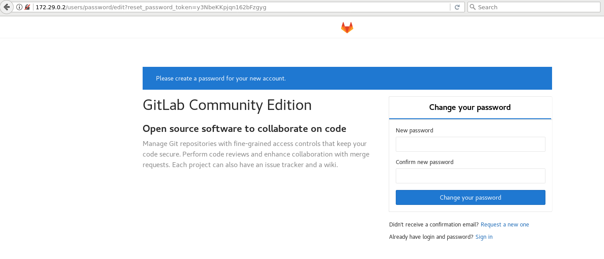

* Par la suite s'authentifier avec le compte **root**, nous avons donc un environnement fonctionnel.

# Configuration 

Configuration de l'environnement **gitlab** , je n'ai pas la prétention d'être un expert, mon objectif est de partager avec vous ma connaissance et ainsi vous faire gagner du temps . Idéalement vous pointer quelques fonctionnalités, que vous n'utilisez pas encore et qui sont vraiment agréable.

L'objectif est principalement une couverture utilisateur avec un peu d'administration.

## Accès au service par les utilisateurs

Premièrement nous allons créer un utilisateur afin de travailler avec ce dernier , comme toujours je n'utilise JAMAIS le compte **root**  sauf quand ceci est requis. Ceci est bien entendu pour des question de sécurité .

Vous l'avez peut-être remarqué par defaut les utilisateurs peuvent se créer eux même des comptes 

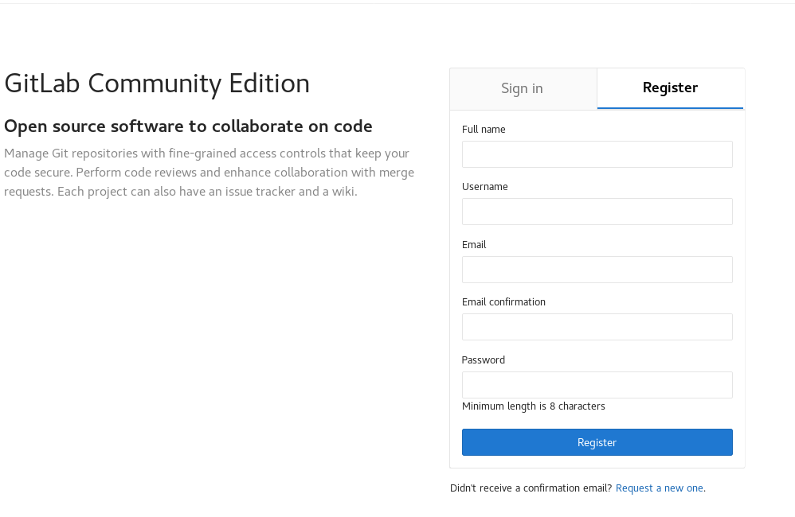

Personnellement, j'ai désactivé cette option, car j'aime avoir le contrôle de mes utilisateurs :P , oui je partage mes scripts , etc mais je veux conserver le contrôle :D.

### Désactivation de l'enregistrement autonome des utilisateurs 

* Établir une connexion comme **root** , cliquez sur la clé anglaise puis sélectionnez **setting** 

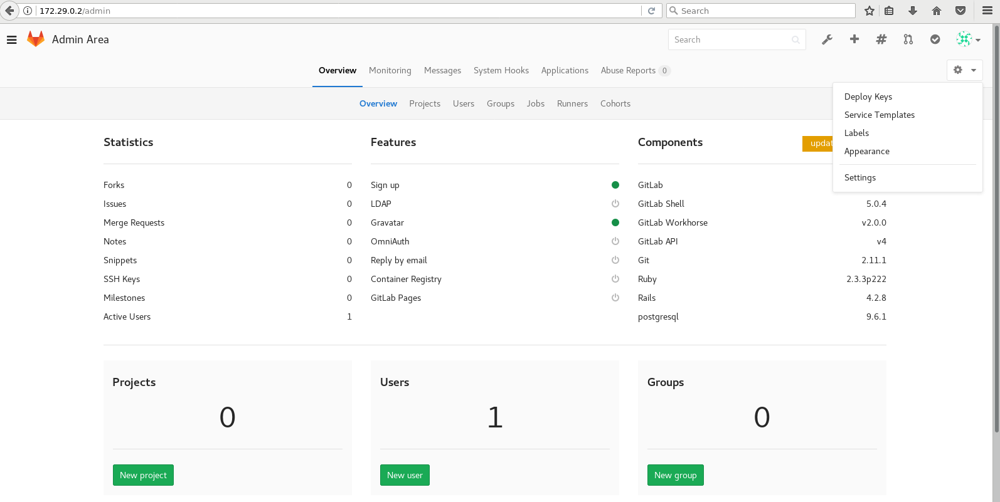

* Descendez et décocher l'option **sign-up enable**


### Création d'un utilisateur

* Toujours comme administrateur **root**  et dans la section __admin__ , vous avez le nombre d'utilisateur actuel et un bouton **new user** disponible

* Voici le résultat quand on définie un utilisateur :


Comme vous pouvez le constater , vous ne définissez pas le mot de passe de l'utilisateur ce dernier recevra par courriel un lien qu'il pourra suivre afin définir lui même sont mot de passe.

Dans notre configuration actuelle le système ne sera pas en mesure de transmettre le courriel car le serveur de relais n'est pas définie et ma machine n'est pas autorisée à transmettre un courriel directement sur Internet. Ceci va nous offrir l'occasion de voir comment réinitialiser un mot de passe :D


### Réinitialisation d'un mot de passe utilisateur

Toujours comme administrateur , nous éditons l'utilisateur et nous pourrons changer le mot de passe.


Et voilà :D

Quand l'utilisateur établira une connexion il devra réinitialisé sont mot de passe 


# Utilisation de gitlab (Utilisateur)

Nous reviendrons éventuellement sur la configuration du service gitlab , mais avant de voir les possibilités voyons l'utilisation simple par la suite nous allons nous créer des "besoins" :P.

## Définition des préférence 

Lors de la première authentification vous aurez le choix de définir vos préférences... Je sais c'est un détail , mais quand c beau comme on l'aime c'est MIEUX :P , on a plus envie de l'utiliser .

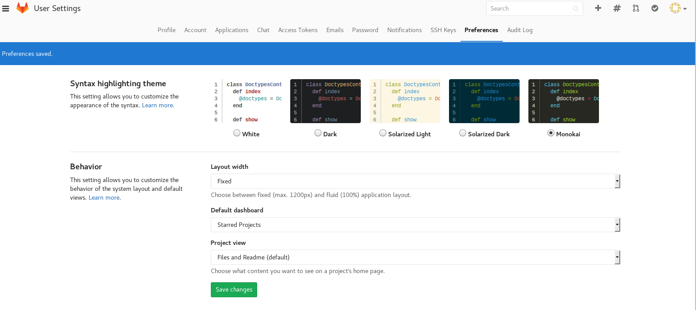

## Définition de groupe

L'objectif des groupes est de permettre un regroupement de projets dans un groupe , en plus de vous permettre une meilleur organisation de vos projets ceci aura aussi l'avantage de vous permettre d'attribuer des permissions sur un groupe pour d'autre utilisateurs .

Nous allons faire la création de deux groupe afin de voir l'interaction possible entre les groupes :

* sysadmin : contiendra les projets de sysadmin telle que les conteneurs , les scripts développés , ...
* __config__ : ceci contiendra la configuration d'une serveur , des conteneurs , ...

Débutons : 

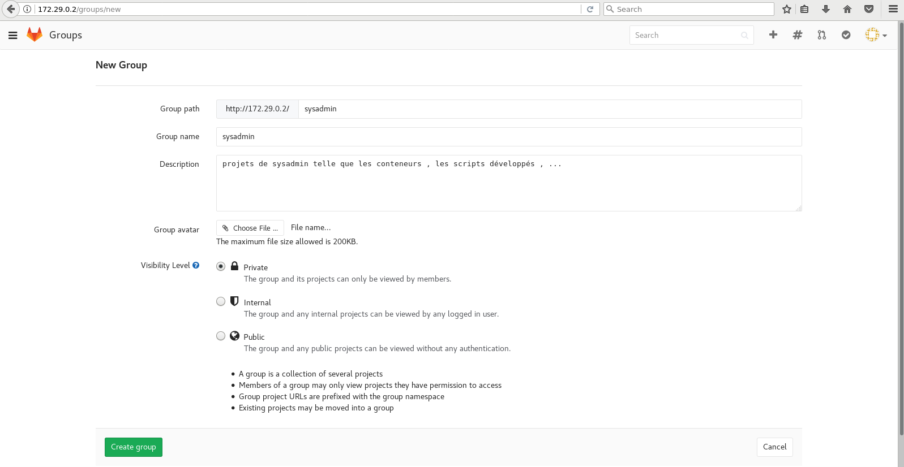


Passons à la création des projets 

## Définition de projet 

Nous allons donc créer des projets sous le groupe sysadmin et __config__ voici la structure pour les besoins de l'exemple :

* sysadmin:
    * dockers : contient nos définitions "primaire de conteneur" pour le moment ceci contiendra surtout notre définition de __gitlab__
    * scripts : contiendra un ensemble de scripts développé , nous l'utiliserons principalement lors de l'intégration avec jenkins ... Mais voyons pour débuter le concept :D.
* config :
    * __goishi-dockers__ : contient la configuration des conteneurs en exécution , car comme nous réalisons des volumes avec les conteneurs qui contienne des configurations je préfère le conserver dans git.
    * __goishi__ : en réalité je vais pas le faire mais en théorie ceci me permet de conserver la configuration de mon serveur en production donc le **/etc**.

Débutons avec la création des projets , démonstration avec 1 .

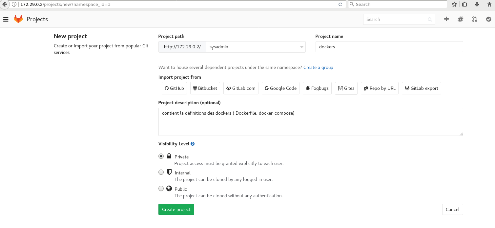

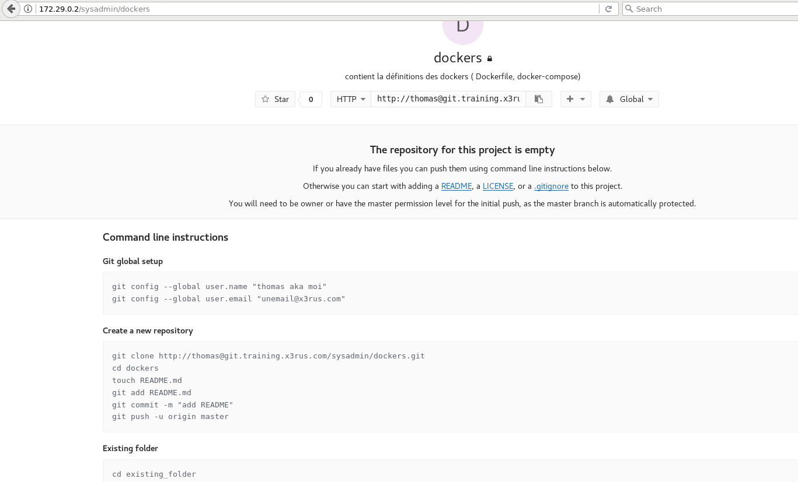

Voici donc le résultat :


## Intégration dépôt local vers le serveur 

Ce qui est magnifique une fois le projet créé est que sur la page du projet vous avez l'ensemble des instructions pour vous accompagner pour transmettre votre dépôt local git vers le serveur. 

**CLARIFICATION** : ce cours n'est pas une formation git si vous voulez plus d'information sur ce point, j'ai quelques vidéos dans la formation Linux 202 sur le sujet ! 

Bien que l'ensemble des instructions sont présent je vais les expliquer ici , car je dois transmettre mes fichiers pour la présentation . J'aime bien recréer la structure localement sur ma machine afin d'avoir la même référence que sur le serveur mais libre à vous ceci n'est pas un requis .

```bash
$ mkdir -p  ~/gitlab-demo/sysadmin/dockers
$ mkdir -p  ~/gitlab-demo/sysadmin/scripts
```

* Je vais mettre en place les fichiers pour le conteneur __gitlab__ :

```bash
$ cp -r ~/git/formations/gitlab/docker/ gitlab-demo/sysadmin/dockers/gitlab/
$ ls -R ~/gitlab-demo/sysadmin/dockers/
/home/xerus/gitlab-demo/sysadmin/dockers/:
gitlab

/home/xerus/gitlab-demo/sysadmin/dockers/gitlab:
docker-compose.yml
```

* Envoyons l'ensemble vers le serveur , comme ceci est un nouveau dépôt nous devrons le créer préalablement 

```bash
$ cd ~/gitlab-demo/sysadmin/dockers/
$ git init .
Initialized empty Git repository in ~/gitlab-demo/sysadmin/dockers/.git/
```

* Si vous n'utilisez pas déjà git , initialisé vos informations "client"

```bash
$ git config --global user.name "thomas aka moi"
$ git config --global user.email "unemail@x3rus.com"
```

* Ajout du répertoire __gitlab__ et commit de la modification dans le dépôt local 

```bash
$ git add gitlab/

$ git status
On branch master

Initial commit

Changes to be committed:
  (use "git rm --cached <file>..." to unstage)

        new file:   gitlab/docker-compose.yml

$ git commit -m "Ajout du conteneur gitlab "
[master (root-commit) d5030d4] Ajout du conteneur gitlab
 1 file changed, 22 insertions(+)
  create mode 100644 gitlab/docker-compose.yml

```

* Ajout du serveur gitlab pour être en mesure de pousser notre configuration 

```bash
$ git remote add origin http://thomas@172.29.0.2/sysadmin/dockers.git

$ git push origin master
Password for 'http://thomas@172.29.0.2': 
Counting objects: 4, done.
Delta compression using up to 4 threads.
Compressing objects: 100% (2/2), done.
Writing objects: 100% (4/4), 642 bytes | 0 bytes/s, done.
Total 4 (delta 0), reused 0 (delta 0)
To http://172.29.0.2/sysadmin/dockers.git

```

* Résultat si nous retournons sur la page du projet , dans gitlab nous verrons nos fichiers 

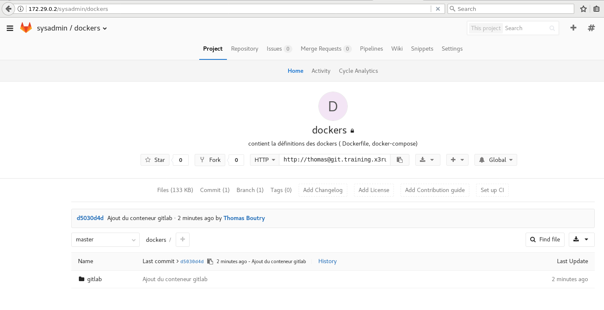

* Le problème est que visuellement c'est pas très beau vous pouvez donc ajouter un __README__ afin d'avoir une description directement dans la visualisation du projet , un peu comme avec __github__ 

```bash
$ cat README.md
 # Description

 Ce projet à pour but de contenir les définitions des conteneurs , ceci est des conteneurs de développement !!

 # Problème connu

**AUCUN**

$ git add README.md
$ git commit -m "Ajout du fichier README "
$ git push origin
```

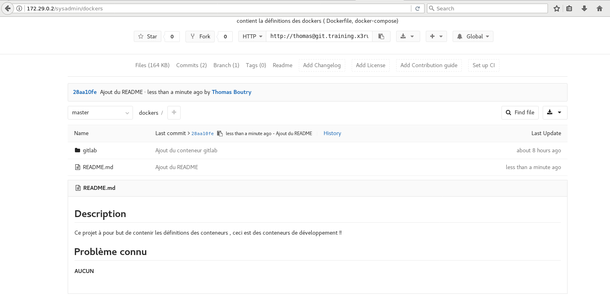

* Nous avons donc le projet sysadmin/dockers de complété , bien entendu il y aura de l'ajout de fichier mais l'idée général est en place , passons à un autre dépôt.


## Intégration dépôt local vers le serveur configuration du conteneur

L'idée général est de conserver notre __docker-compose et DockerFile__ de gitlab, cependant une fois en exécution, nos conteneurs on bien souvent des volumes de configurer et il nous arrive de modifier ces fichiers de configuration. L'idée du dépôt goishi-dockers est justement de répondre à cette situation . 

Si je reprend l'idée du conteneur gitlab 

```bash
$ cat gitlab/docker-compose.yml | grep etc
            - '/srv/docker/x3-gitlab-f/gitlab/etc:/etc/gitlab'
```

Je vais donc configurer le répertoire __/srv/docker__ afin qu'il soit ré visionné , c'est partie.

```bash
$ cd /srv/docker/
$ ls
coco-db-t  ossec  x3Apache  x3-gitlab  x3-gitlab-f  x3-jenkins

$ sudo git init .
Initialized empty Git repository in /srv/docker/.git/``
```

* Ajout du répertoire de configuration de __gitlab__ 

```bash
$ sudo git add x3-gitlab-f/gitlab/etc/
```

* Mais il y a plein de fichier qui sont présent dont je n'ai que peu d'intérêt donc je vais ignorer ces fichiers car ils ne sont que pour des testes et je ne veux pas qu'il soit pris en considération . Comme vous pouvez le voir pour le moment AUCUN commit ne fut réalisé vers le serveur, tous est local.

```bash
$ $ sudo git status
On branch master

Initial commit

Changes to be committed:
  (use "git rm --cached <file>..." to unstage)

   new file:   x3-gitlab-f/gitlab/etc/gitlab-secrets.json
   new file:   x3-gitlab-f/gitlab/etc/gitlab.rb
   new file:   x3-gitlab-f/gitlab/etc/ssh_host_ecdsa_key
   new file:   x3-gitlab-f/gitlab/etc/ssh_host_ecdsa_key.pub
   new file:   x3-gitlab-f/gitlab/etc/ssh_host_ed25519_key
   new file:   x3-gitlab-f/gitlab/etc/ssh_host_ed25519_key.pub
   new file:   x3-gitlab-f/gitlab/etc/ssh_host_rsa_key
   new file:   x3-gitlab-f/gitlab/etc/ssh_host_rsa_key.pub

Untracked files:
  (use "git add <file>..." to include in what will be committed)

  coco-db-t/
  ossec/
  x3-gitlab-f/gitlab/data/
  x3-gitlab-f/gitlab/logs/
  x3-gitlab/
  x3-jenkins/
  x3Apache/


$ sudo git status  | egrep -v "new file" | grep "/$" | tr -d "\t"
coco-db-t/
ossec/
x3-gitlab-f/gitlab/data/
x3-gitlab-f/gitlab/logs/
x3-gitlab/
x3-jenkins/
x3Apache/

$ sudo vim .gitignore

$ sudo git add .gitignore

$ sudo git commit -m "Ajout fichier de configuration de gitlab et gitignore"

```

* Tous comme la dernière fois on ajoute la configuration pour être en mesure de pousser la configuration et on pousse

```bash
$ sudo git remote add origin http://thomas@172.29.0.2/config/goishi-dockers.git
$ sudo git push origin master
Password for 'http://thomas@172.29.0.2': 
Counting objects: 14, done.
Delta compression using up to 4 threads.
Compressing objects: 100% (12/12), done.
Writing objects: 100% (14/14), 25.89 KiB | 0 bytes/s, done.
Total 14 (delta 0), reused 0 (delta 0)
To http://172.29.0.2/config/goishi-dockers.git
 * [new branch]      master -> master

```

Résultat :

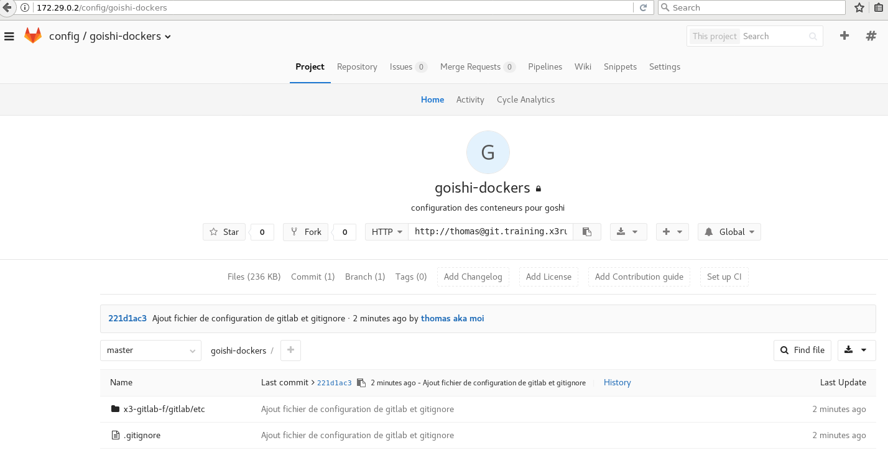

## Intégration dépôt configuration du serveur 

J'ai fait la création d'un dépot __config/goishi__ ce dépôt va me servir pour la configuration du serveur , en fait sous __config/NOM\_SERVER__ je conserve toujours le répertoire __/etc__ vielle habitude avant d'être sous docker :P , c'était critique pour conserver les applications localement définie.
Maintenant bien que moins critique ça me permet de conserver l'ensemble de l'information de la machine que la configuration soit local (liste des utilisateurs , configuration du système de gestion de la configuration (puppet), script d'initialisation ... ) 

Nous allons donc procéder avec la configuration .

```bash
$ cd /etc/
$ sudo git init .
Initialized empty Git repository in /etc/.git/
$ sudo git add *
$ sudo git commit -m "Ajout du répertoire etc pour goishi"

$ sudo git push origin master
Password for 'http://thomas@172.29.0.2': 
Counting objects: 1078, done.
Delta compression using up to 4 threads.
Compressing objects: 100% (836/836), done.
Writing objects: 100% (1078/1078), 3.36 MiB | 3.45 MiB/s, done.
Total 1078 (delta 40), reused 0 (delta 0)
remote: Resolving deltas: 100% (40/40), done.
To http://172.29.0.2/config/goishi.git
 * [new branch]      master -> master
```

# Concept de l'organisation 

Voici en gros le concept de l'organisation de la structure, ceci est une suggestion libre à vous de l'utiliser ou pas , donc uniquement suggestion mais j'aime bien ce mode de travail. Peu importe ce que je vous montre aujourd'hui dans 3 mois vous l'avez oublié si vous l'utilisez pas, puis honnêtement on s'en fou :p puis c'est correct ... Par contre les concepts on tendance à resté plus longtemps :P. 

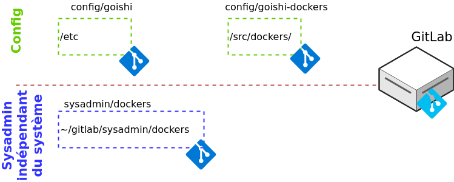
