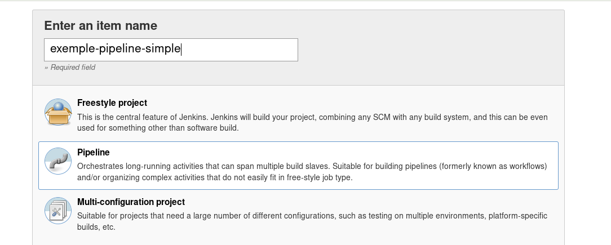
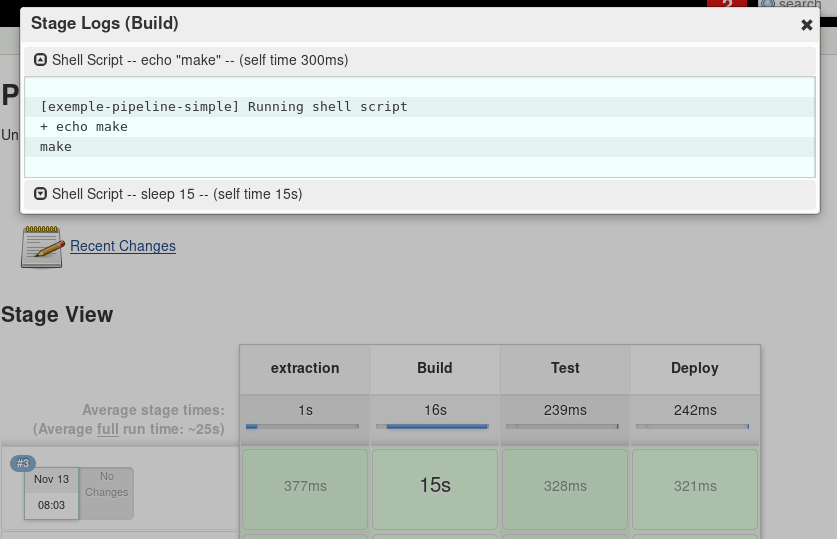
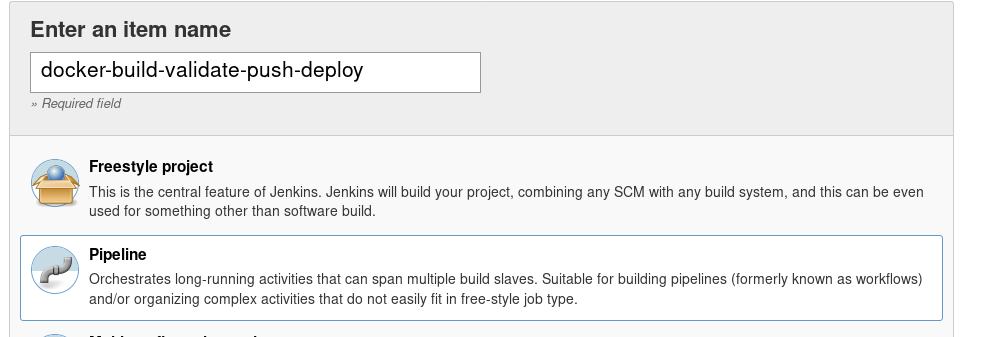
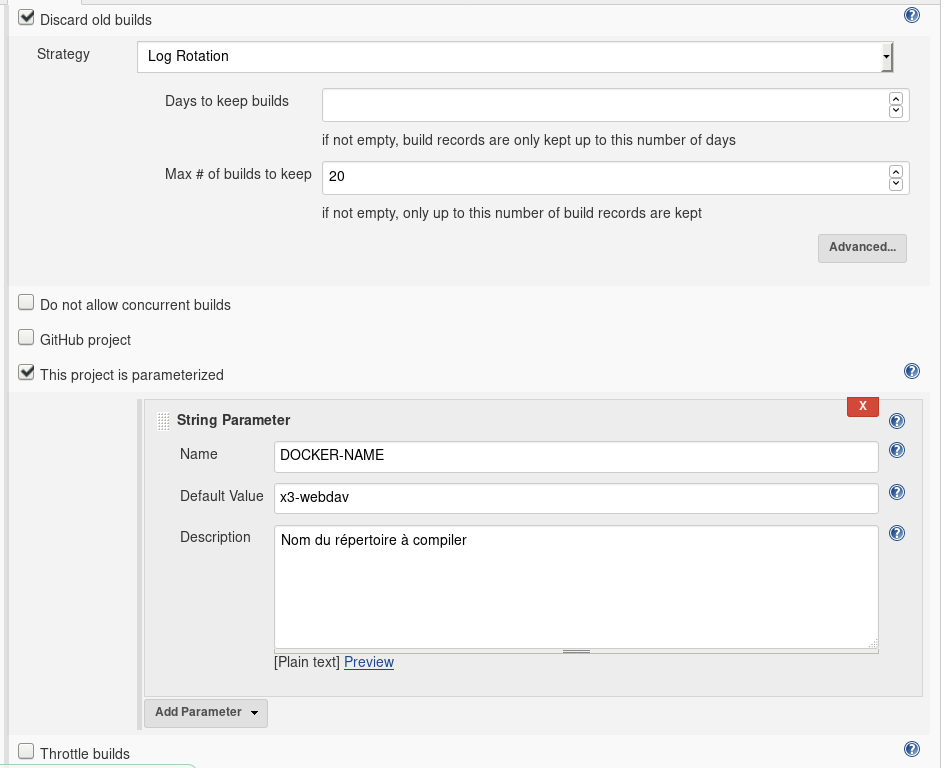
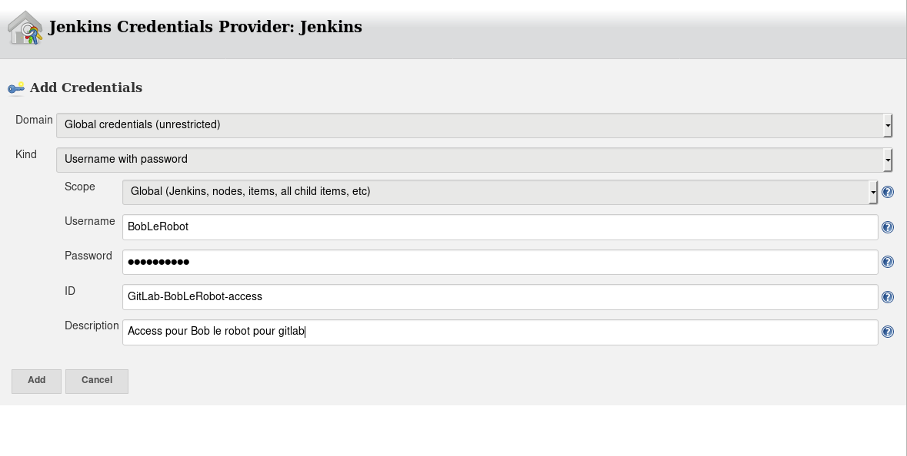
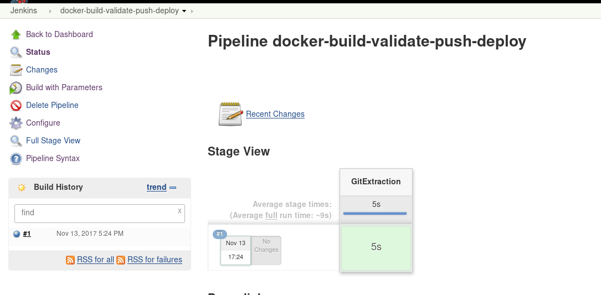
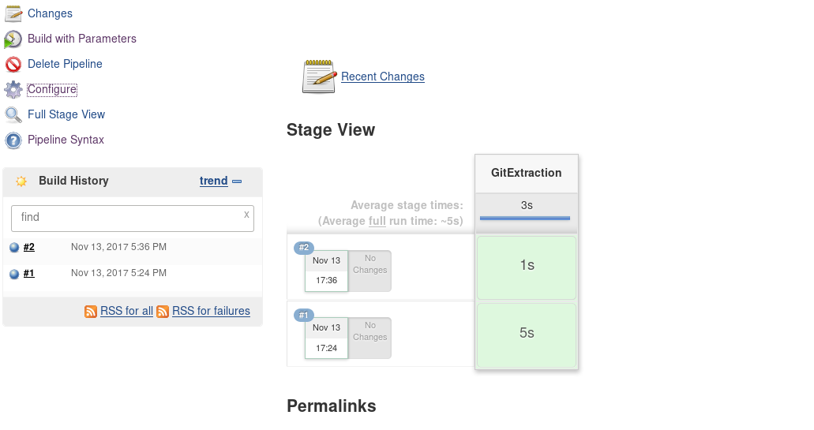
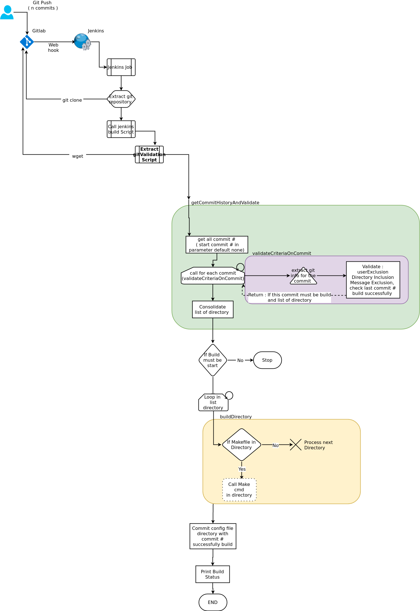
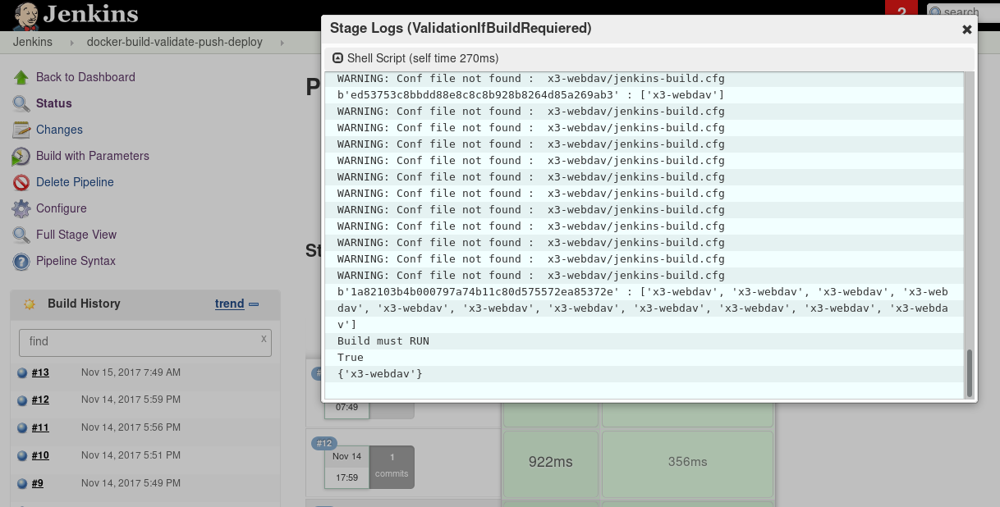
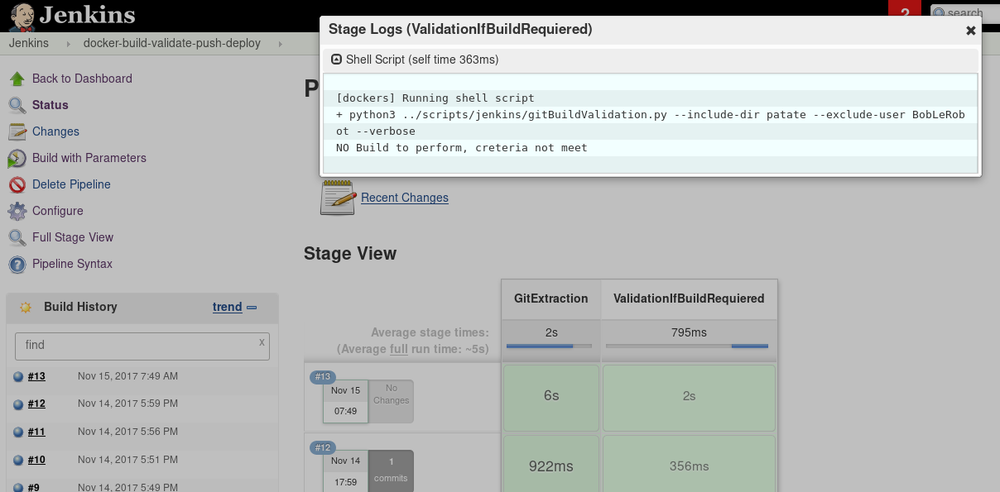

# Jenkins PipeLine et Docker

Lors de la présentation de Jenkins nous avons fait une démonstration de l'outil je dirait de manière classique , nous avons mis en place Jenkins et définie des slaves que nous avons configurer. Dans les slaves nous avions permis l'utilisation de Docker grâce au commande **docker \*** , cependant nos conteneurs avec la fonctionnalité docker avait un problème. Nous avions notre conteneur en exécution continuel , alors que l'avantage du système de conteneur est d'avoir une démarrage des services au besoin. Nous allons donc voir comment modifier notre configuration afin de permettre que ceci soit plus dynamique selon le besoin . En d'autre mot suivre les meilleurs pratique actuellement. 

Avant de voir ce coté du démarrage dynamique des conteneurs , j'aimerai que l'on voit le concept de Pipeline qui est aussi la nouvelle mode de configuration de Jenkins ... allé n'attendons plus c'est PARTIE !!!!

Référence de documentation : 

* https://jenkins.io/doc/book/pipeline/
* a revalider dans le temps
    * https://dzone.com/articles/jenkins-pipeline-plugin-tutorial

## Avant de débuter

Avant de débuter la configuration nous allons faire 2 choses .

1. Préparer notre environnement de travail 
2. Établir le cas d'utilisation 

Je fais la distinction entre les 2 , ceci vous permettra de vous organiser tout seul si finalement le cas que je propose ne vous intéresse pas :P .

### Préparation de l'environnement (Minimal)

Oui malheureusement pour pouvoir faire tous ça faut d'abord ce préparer , comme toujours nous allons utiliser Docker pour l'exercice , je vas passer très très rapidement sur ce point. Je vous invite à consulter la [première session sur Jenkins](../jenkins/01-presentation.md) pour avoir l'ensemble des instructions. 

En fait j'aurais réutilisé le setup de la dernière fois mais j'ai détruit l'ensemble des volumes créer donc ... pas le choix de reprendre. Nous allons mettre 3 conteneurs :

* Jenkins :D
* Un slave Jenkins avec le support de dockers actif en permanence , nous utiliserons les instructions docker run , docker-compose , ... Pour initialisé les conteneur. Nous verrons par la suite l'autre méthode pour avoir quelque chose de plus dynamique
* un serveur gitlab , vous pouvez utilisez le votre libre à vous, voir github , mon objectif est d'avoir un écosystème complet fonctionnel avec peu de dépendance externe.

Le fichier docker-compose est disponible : [dockers/docker-compose.yml](./dockers/docker-compose-v1.yml)

Avant de démarrer le conteneur je vais créer le répertoire :

```bash
$ sudo mkdir -p /srv/docker/x3-jenkinsWithPipe-f/jenkins-data
$ sudo chown 1000:1000 /srv/docker/x3-jenkinsWithPipe-f/jenkins-data
```

Démarrons le conteneur jenkins nous devrons refaire la configuration initialisé en mettant en place les plugins de base , ... Tous ça fut couvert dans le première session , je vais aussi faire la configuration du gitlab couvert lors de la [présentation de gitlab](../gitlab/01-presentation.md)

Étapes réalisées :

1. Setup initial jenkins avec plugins recommandés
2. Setup initial Gitlab root (mot de passe par défaut) 
3. Création d'un utilisateur dans gitlab avec possibilité de créer des projets...
4. Configuration du slave, comme ceci est peut-être moins évident un peu d'information
    * Vous avez la clé privé du slave disponible dans le fichier [data/jenkins-nodes_rsa](./data/jenkins-nodes_rsa)
    * J'ai aussi réalisé une copie d'écran [01-jenkins-setup-slave-dck01.png](./imgs/01-jenkins-setup-slave-dck01.png)


### Cas d'utilisation

Je vais reprendre le cas utilisé lors de la présentation de Jenkins , en d'autre mot le cas de :

1. la compilation d'un conteneur **docker** 
2. La validation si un conteneur doit être compiler 
3. La compilation de ce dernier
4. La validation du conteneur 
5. Pousser le conteneur dans le __docker registry__ \[Ajout comparativement à la session passé\]
6. Possibilité de démarrer le conteneur sur un __docker host__ \[Ajout comparativement à la session passé\]

Pour rappel mon dépôt git contenant la définition de mes conteneurs n'est pas idéal , j'ai un dépôt pour l'ensemble des mes dockers , il serait plus adéquat d'avoir un projet par conteneur. Pour le moment je garde cette organisation et tricote autour. 

Comme toujours nous avancerons par phase :

1. Extraction du dépôt , compilation du conteneur identifié en paramètre (nom du répertoire) , processus de validation de ce dernier.
2. Reprise des opérations de la **phase 1**  plus , validation du requis de compilation , pousser l'imagine du conteneur dans le __docker registry__ 
3. Démarrage du service sur le docker host.

### Suite de la préparation avec le cas d'utilisation

Bon bien entendu nous allons avoir besoin dans un premier temps de la configuration de notre Gitlab afin d'être en mesure d'extraire le code source. 
Bien entendu vous pouvez toujours utiliser Github pour l'exercice , comme toujours l'objectif est d'être autonome et maître de notre environnement Github est un service gratuit mais pas libre. Vous ne pouvez pas l'avoir en service hébergé à l'interne et il y a des coûts pour fermer l'accès au code. 

J'ai donc ( Pour les informations sur la configuration gitlab , j'ai une formation sur le sujet : [Gitlab Formation](../gitlab/01-presentation.md):

1. Créé MON utilisateur 
2. Créer un groupe Devops 
3. Création du projet dockers contenant 3 répertoires avec des conteneurs

Une copie d'écran disponible ici : [02-setup-gitlab-depot-conteneur.png](./imgs/02-setup-gitlab-depot-conteneur.png) 

Le dépôt est aussi disponible sur Github : [training-jenkins-dockers-pipeline](https://github.com/x3rus/training-jenkins-dockers-pipeline)

En plus de mes accès je vais aussi définir un utilisateur "robot" qui pourra extraire et écrire dans le dépôt. Son nom sera "BobLeRobot" 
Encore une fois l'ensemble des ces opérations furent couvert dans la formation initial de Jenkins lors de l'intégration avec GitLab


## Les Pipelines avec Jenkins

Nous avons vue lors des sessions passées l'utilisation de Jenkins avec le système de conteneurs , ceci fonctionnait très bien cependant comme nous avons pu le voir la segmentation des actions n'est pas obligatoirement claire en lisant le logs de résultat. Si nous avions une équipe de développement , de QA ou des personnes en charge de l'infrastructure quand il y a une erreur une personne doit être en mesure d'analyser le log pour le transmettre à la bonne équipe. Vous me répondrez probablement, mais ce n'est pas la tâches du DevOps de faire ça , heu ... oui et non . Nous pourrions le dire ainsi c'est le DevOps à le faire puis de transmettre l'information. Mais un bon DevOps c'est quoi , c'est une personne super paresseuse , excusez on dit habituellement une personne qui optimise sont temps :P.

Pour optimiser notre temps l'idée est de réussir à aviser les bonnes personnes pour la bonne action ! Notre problème aujourd'hui est que nous avons une tâches ("build") qui réalise l'ensemble de l'opération nous pouvons transmettre un courriel à la fin mais à qui ? QA , Dev, Infra , Ops , ... 

Aujourd'hui ça va on fait le build et la validation , mais que ce passerez t'il si nous avions :

* la compilation de l'application
* La création du conteneur
* La réalisation de la validation
* Le déploiement sur un environnement de test d'intégration
* La deuxième passe de test

Comment si ceci est dans 1 build informer les bonnes personnes. Jenkins offre traditionnellement le mécanisme qui nous permet d'appeler d'autre tâches à la fin d'un tâches et de définir des conditions . Cependant si vous l'avez déjà utilisé dans le passez vous savez comme moi que ce n'est pas simple de visualiser le statu de l'ensemble des tâches de d'identifier l'imbrication des ces dernières pour le commun des mortelles.

Le concept de pipe fut mis en place afin de facilité le mécanisme. Nous allons donc convertir notre mécanisme avec les pipes.


### Présentation du concept de Pipeline

TODO : à compléter

* https://jenkins.io/doc/book/pipeline/
* https://jenkins.io/doc/book/pipeline/syntax
* https://jenkins.io/doc/pipeline/steps/

### Un exemple simple avant la démonstration complexe

Voici un petit exemple de mise en place d'un pipeline , l'objectif est simplement de démontré l'utilisation avec les steps sans aucune complexité , dans un second temps nous mettrons l'ensemble du système de **SCM**.

* Création de la tâches



* Voici la configuration mise en place pour le **pipeline** :

```
pipeline {
    
    agent { node { label 'docker' } }
    
    stages {
        stage('extraction') { 
            steps { 
                sh 'echo " Ze extraction" ' 
            }
        }
        stage('Build') { 
            steps { 
                sh 'echo "make" '
                sh 'sleep 30' 
            }
        }
        stage('Test'){
            steps {
                sh 'echo "make check"'
            }
        }
        stage('Deploy') {
            steps {
                sh 'echo "make publish"'
            }
        }
    }
}
```

Explication rapide :

1. **[agent](https://jenkins.io/doc/book/pipeline/syntax/#agent)** : Je sélectionne un node avec l'étiquette __docker__
2. **[stages](https://jenkins.io/doc/book/pipeline/syntax/#stages)** : Je définie que nous allons avoir plusieurs étapes 
3. **[stage](https://jenkins.io/doc/book/pipeline/syntax/#stage)** : Définition des différentes groupe de tache "stage", comme nous voyons dans le stage Build il y a 2 étapes.
4. **[steps](https://jenkins.io/doc/book/pipeline/syntax/#steps)** : Permet de définir les étapes qui seront réalisé lors de ce stage.
5. **[sh](https://jenkins.io/doc/pipeline/steps/workflow-durable-task-step/#sh-shell-script)** : Permet d'exécuter un script lors de l'étape mais il existe énormément de méthode disponible : [listes de step disponible](https://jenkins.io/doc/pipeline/steps/) 

Voici le résultat , comme vous pouvez le voir j'ai fait une erreur lors de la première exécution :D : 

 

Ce qui est intéressant est que vous êtes en mesure de visualiser les logs d'une seule étapes , simplifiant l'analyse de la situation :


Ainsi que voir le détail :



## Mise en place du pipeline pour notre cas d'utilisation

Bon voilà on a vu un cas d'utilisation super simpliste pour ce faire la main , maintenant c'est le moment de votre nos cas d'utilisation concret. 
Pour les besoins de la présentation je vais diviser la présentation avec les étapes (step) de notre pipeline.  

Donc nous reprenons la création de la tâche en mode pipeline :



Nous allons conserver les logs de compilations  pour les 20 dernières exécution, et passez en paramètre le nom du répertoire donc du conteneur à traiter. Bien entendu nous alimenterons la configuration au furent et à mesure que nous ajoutons des fonctionnalités.

 


### Configuration initiale pour le choix du node 

Comme nous avons un conteneur à compiler nous allons identifier que le node qui réalisera l'opération doit avoir l'étiquette __docker__ , la documentation est disponible **[pipeline syntaxe agent](https://jenkins.io/doc/book/pipeline/syntax/#agent)**  pour voir les autres options disponible.

```
pipeline {
    
    agent { node { label 'docker' } }
```

### Extraction du projet depuis gitlab.

Donc je vais utiliser le **pipeline syntax** éditeur pour m'aider à faire la configuration de mon extraction de git. Voici l'interface résultant de l'opération : 


J'ai aussi fait la création de l'identifiant dans jenkins afin de permettre **BobLeRobot** d'avoir les informations (user + password) dans jenkins et utilisable globalement 



J'ai par la suite cliqué pour généré l'instruction pipeline :


Voici le résultat dans son ensemble :

```

pipeline {

    agent { node { label 'docker' } }
    
     stages {
         stage('GitExtraction') {
             steps {
                checkout([$class: 'GitSCM', branches: [[name: '*/master']], doGenerateSubmoduleConfigurations: false, extensions: [], submoduleCfg: [], userRemoteConfigs: [[credentialsId: 'GitLab-BobLeRobot-access', url: 'http://gitlabsrv/Devops/dockers.git']]])
            }
        }
     }
}
```

Nous l'exécutons pour se faire plaisir :

 

Ceci fonctionne bien , cependant mon script pour le traitement du build , donc la logique est aussi dans un autre dépôt GIT , plusieurs option s'offre à moi :

* mettre en place un __submodule__ dans le projet de dockers afin qu'il puisse faire l'extraction de l'outil. C'est bien mais que ce passe t'il si j'ai pas le contrôle des 2 dépôt . T'AS JUSTE À FORKER !!! ok ok , mais si je peux pas / veux pas ... Blabla :P 
* Récupérer le scripts depuis un dépôt d'artefacts telle que Maven ou autre , donc pas depuis une source qui peut bouger, ceci est la meilleur option. Dans le cadre professionnel c'est le bon choix ... Mais moi ça bouge beaucoup je veux pas faire une release de mon script même si c automatique la nuit ... Pas pour le moment. Puis en plus c'est l'option facile :P. On y reviendra si vous le voulez bien.
* Je vais faire l'extraction des 2 dépôt Git .

Voici la syntaxe pipeline, juste pour ennuyer ou montrer d'autre option j'ai utilisé le module git de pipeline syntaxe :

```

pipeline {

    agent { node { label 'docker' } }
    
     stages {
         stage('GitExtraction') {
             steps {
                checkout([$class: 'GitSCM', branches: [[name: '*/master']], doGenerateSubmoduleConfigurations: false, extensions: [], submoduleCfg: [], userRemoteConfigs: [[credentialsId: 'GitLab-BobLeRobot-access', url: 'http://gitlabsrv/Devops/dockers.git']]])

                git credentialsId: 'GitLab-BobLeRobot-access', url: 'http://gitlabsrv/Devops/scripts.git'
            }
        }
     }
}

```

Donc nous avons les 2 commandes GIT dans le stage __GitExtraction__ , mais voici le résultat , pas d'erreur mais ...

 

Donc il est où le problème , si nous regardons le workspace sur le slave il n'y a QUE le second git clone :

```
root@jenkins-slave-dck:/home/jenkinbot/workspace/docker-build-validate-push-deploy# ls -ltr                                                                   
total 4                                
-rw-rw-r-- 1 jenkinbot jenkinbot  32 Nov 13 17:36 README.md                    
drwxrwxr-x 4 jenkinbot jenkinbot 189 Nov 13 17:36 jenkins         
```

Voici la solution à notre problèmes. Je fais la création de 2 répertoire 1 pour les dockers et un pour les scripts  et j'exécute les git fetch depuis le répertoire.

```
pipeline {

    agent { node { label 'docker' } }
    
    stages {
         stage('GitExtraction') {
             steps {
                dir('dockers') {
                    checkout([$class: 'GitSCM', branches: [[name: '*/master']], doGenerateSubmoduleConfigurations: false, extensions: [], submoduleCfg: [], userRemoteConfigs: [[credentialsId: 'GitLab-BobLeRobot-access', url: 'http://gitlabsrv/Devops/dockers.git']]])
                }
                dir('scripts') {
                    git credentialsId: 'GitLab-BobLeRobot-access', url: 'http://gitlabsrv/Devops/scripts.git'
                }
            }
        }
    }
}
```

Voici le résultat lors de l'exécution :

```bash
root@jenkins-slave-dck:/home/jenkinbot/workspace/docker-build-validate-push-deploy$ ls -l
total 4
-rw-rw-r-- 1 jenkinbot jenkinbot  32 Nov 13 17:36 README.md
drwxrwxr-x 6 jenkinbot jenkinbot  96 Nov 14 07:48 dockers
drwxrwxr-x 2 jenkinbot jenkinbot   6 Nov 14 07:48 dockers@tmp
drwxrwxr-x 4 jenkinbot jenkinbot 189 Nov 13 17:36 jenkins
drwxrwxr-x 4 jenkinbot jenkinbot  50 Nov 14 07:48 scripts
drwxrwxr-x 2 jenkinbot jenkinbot   6 Nov 14 07:48 scripts@tmp

```

Super maintenant nous avons nos informations depuis le dépôt gitlab :D yeahh , on va continuer avec la réalisation de la création du conteneur .

### Création de l'image du conteneur

Nous allons passer à l'étape de création de l'image du conteneur , suivant le système mis en place lors de notre dernière formation Jenkins j'avais mis un système de condition permettant de valider si une image de conteneur doit être construite ou non. Un petit rappel du système de validation réalisé : 

* Nom utilisateur (inclus / exclus) 
* Message dans le commit 
* Répertoire inclus 
* Numéro du commit si transmis ( Expérimental  , la réalité tous est expérimental :P , mais cette partie plus !! )

Voici le schéma :




#### Mise en place de la validation si le build est requis

Je vais donc mettre en place le processus de validation avec mon script Jenkins , voici le résultat :

```
pipeline {

    agent { node { label 'docker' } }
    
     stages {
         stage('GitExtraction') {
             steps {
                dir('dockers') {
                    checkout([$class: 'GitSCM', branches: [[name: '*/master']], doGenerateSubmoduleConfigurations: false, extensions: [], submoduleCfg: [], userRemoteConfigs: [[credentialsId: 'GitLab-BobLeRobot-access', url: 'http://gitlabsrv/Devops/dockers.git']]])
                }
                dir('scripts') {
                    git credentialsId: 'GitLab-BobLeRobot-access', url: 'http://gitlabsrv/Devops/scripts.git'
                }
            }
         }
         stage('ValidationIfBuildRequiered') {
             steps {
                    dir('dockers') {
                        sh returnStatus: true, script: 'python3 ../scripts/jenkins/gitBuildValidation.py --include-dir $DOCKER_NAME --exclude-user BobLeRobot --verbose'
                    }
                }
            }
    }
}

```

Donc dans le cas présent j'exécute et ajoute affiche le résultat :



Même exécution mais pour un répertoire inexistant : 



Ceci est donc un exemple d'étape de validation , mais l'étape n'est PAS vraiment la mise en place de la condition l'étape est de savoir SI nous devons ......... Dans notre cas compiler le répertoire qui contient le conteneur, après plusieurs essaie et exploration voici la formule . Nous allons passer à travers :

```

// Methode loop pour faire l'appel du MAKE
def int loop_build_docker(list) {

    for (def dockerDir : list.split(",")  ) {
           dir("dockers")
           {
                sh (script: "make -C ${dockerDir} build-4-test")
           }
    }
} 
    
pipeline {

    agent { node { label 'docker' } }
   

     stages {
         stage('GitExtraction') {
             steps {
                dir('dockers') {
                    checkout([$class: 'GitSCM', branches: [[name: '*/master']], doGenerateSubmoduleConfigurations: false, extensions: [], submoduleCfg: [], userRemoteConfigs: [[credentialsId: 'GitLab-BobLeRobot-access', url: 'http://gitlabsrv/Devops/dockers.git']]])
                }
                dir('scripts') {
                    git credentialsId: 'GitLab-BobLeRobot-access', url: 'http://gitlabsrv/Devops/scripts.git'
                }
            } // End Steps
         } // End Stage GitExtraction

         stage('BuildDockers') {
             when {
                expression {
                    dir('dockers') {
                        // Version avec le code de retour
                        MUST_BUILD = sh( returnStatus: true,
                                        script: 'python3 ../scripts/jenkins/gitBuildValidation.py --include-dir $DOCKER_NAME --exclude-user BobLeRobot' 
                                       )
                        // Corrige le comportement du bash pour qui : 
                        // 0 ==  True 
                        // autre == False :P 
                        if (MUST_BUILD == 0) {
                            return 1
                        }
                    } // END repertoire docker
                } // fin expression 
             } // END When

            steps {
                loop_build_docker(DOCKER_NAME)
            }

         } // END Stage 'BuildDockers'
     } // End StageS
    
} // END pipeline
```

Donc Regardons un peu l'étape **BuildDockers** , nous avons les bloques :

* **when** : Ceci nous permet d'indiquer qu'il y a une condition pour cette étape 

### tmp copie de sécurité :P

```
def int loop_build_docker(list) {

    for (def dockerDir : list.split(",")  ) {
           dir("dockers")
           {
                sh (script: "make -C ${dockerDir} build-4-test")
           }
    }
} 
    
pipeline {

    agent { node { label 'docker' } }
   

     stages {
         stage('GitExtraction') {
             steps {
                dir('dockers') {
                    checkout([$class: 'GitSCM', branches: [[name: '*/master']], doGenerateSubmoduleConfigurations: false, extensions: [], submoduleCfg: [], userRemoteConfigs: [[credentialsId: 'GitLab-BobLeRobot-access', url: 'http://gitlabsrv/Devops/dockers.git']]])
                }
                dir('scripts') {
                    git credentialsId: 'GitLab-BobLeRobot-access', url: 'http://gitlabsrv/Devops/scripts.git'
                }
            } // End Steps
         } // End Stage GitExtraction

         stage('BuildDockers') {
             when {
                expression {
                    dir('dockers') {
                        // Version avec le output
                        // LST_DIR = sh( returnStdout: true,
                        //        script: 'python3 ../scripts/jenkins/gitBuildValidation.py --include-dir $DOCKER_NAME --exclude-user BobLeRobot' )
                            
                        // Version avec le code de retour
                        MUST_BUILD = sh( returnStatus: true,
                                        script: 'python3 ../scripts/jenkins/gitBuildValidation.py --include-dir $DOCKER_NAME --exclude-user BobLeRobot' 
                                       )
                            
                        // Debug mod pour comprendre 
                        println "return code dirs value " 
                        println MUST_BUILD
                        // Corrige le comportement du bash pour qui : 
                        // 0 ==  True 
                        // autre == False :P 
                        if (MUST_BUILD == 0) {
                            return 1
                        }
                    }
                    
                }
             } // END When

            steps {
                loop_build_docker(DOCKER_NAME)
            }

         } // END Stage 'BuildDockers'
     } // End StageS
    
} // END pipeline


```

Référence intéressante : https://support.cloudbees.com/hc/en-us/articles/230610987-Pipeline-How-to-print-out-env-variables-available-in-a-build
