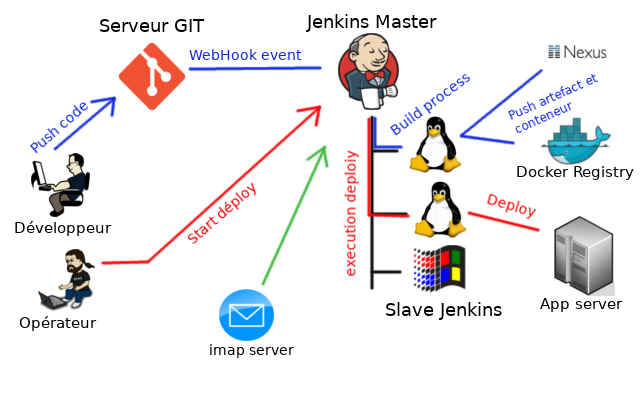
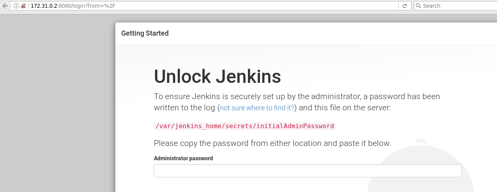
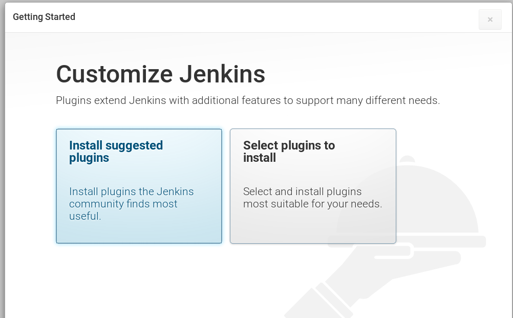
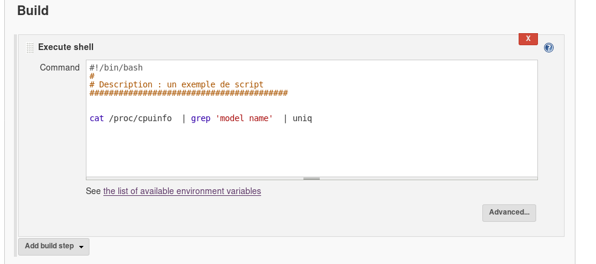
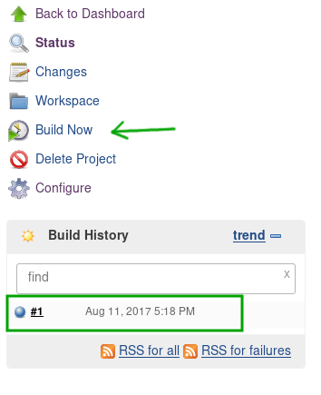
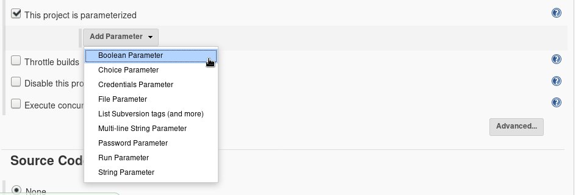
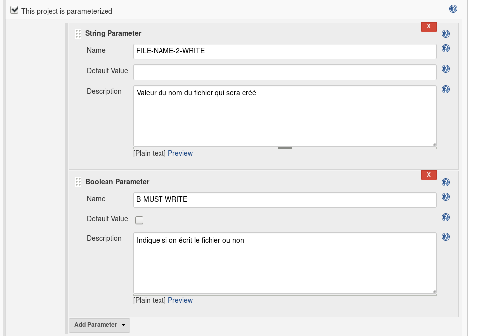

# Présentation de Jenkins


En 2008 Jenkins devient LA solution pour l'intégration continue en remplacement de [CruiseControl](https://fr.wikipedia.org/wiki/CruiseControl). 

Le puis fort de Jenkins en plus de ça grande communauté est qu'il existe un nombre impressionnant de __plugins__ permettant d'étendre les fonctionnalités simple de l'outil.

Il est possible de lié Jenkins  avec __Subversion__ , __Git__ , et d'autre contrôleur de révision, il est possible de l'utiliser comme planificateur de tâche comme **cron** afin de réalisé des opérations périodique. Vous pouvez aussi lancer des exécutions à la demande ou utiliser des __webhook__ pour déclencher une opération par programmation. Nous allons couvrir quelque possibilité cependant telle que mentionné avec le nombre de plugins disponible les champs de possibilités sont nombreuses.

[Site web officiel de Jenkins](https://jenkins.io/). 

Que pouvons nous exécuter avec Jenkins ? 

* Des projets basés sur Apache Ant 
* Apache Maven 
* Des scripts arbitraires en shell Unix ou batch Windows. ( En d'autre mot N'IMPORTE QUOI :D ) 

L'application est développé en Java et sous [Licence MIT](https://fr.wikipedia.org/wiki/Licence_MIT)

## Architecture de Jenkins 

Avant de débuter avec l'installation voyons l'idée général du rôle de Jenkins et ça conception . 

Chaque tâche est une job, lors de l'exécution de la job nous exécutons un **build** , même si le résultat n'est QUE l'envoie d'un courriel ou le traitement de donnée, mais qu'aucune compilation n'est réalisé :D.

Jenkins fonctionne en mode master / slave :

* **Master** : reçoit les évènements que nous parlions d'évènement généré par le serveur Subversion, git, exécution d'un build manuellement par un utilisateur. Selon les critères saisie le système choisi un **slave** pour réaliser les opérations, nous verrons que nous utilisons les labels pour assigner des jobs au slave. Le serveur **master** contient l'ensemble des définitions **centralisé** contenant la description des opérations à faire ! Si tous les slaves sont déjà en utilisation le serveur va mettre en place un file d'attente.
* **Slave** : Le serveur slave est donc un agent du master, il réalisera l'opération demandé par le serveur Jenkins , bien entendu si le serveur Jenkins essaye d'exécuter une commande sur la machine elle doit être installé. Il est important donc d'avoir un __template__ , modèle pour que l'ensemble des serveurs slave est la même configuration. Comme Jenkins est développé en Java il est possible d'avoir des agents sur plusieurs type de système d'exploitation 

Voici une représentation graphique du fonctionnalité simple de Jenkins :



Dans la pratique le serveur Jenkins peut être aussi être utilisé comme slave, cependant ceci est limitatif autant en terme de puissance que des possibilités d'avoir plusieurs architecture et / ou des lieux de traitement à plusieurs endroits.

Telle que mentionné plus tôt le nombre de plugins sont impressionnant : [https://plugins.jenkins.io/](https://plugins.jenkins.io/)

## Installation de Jenkins 

Bon nous orientons surtout la formation sur la pratique donc débutons avec l'installation , honnêtement je suis super paresseux et depuis l'arrivée **docker** ça n'a pas arrangé les choses. En d'autre mot je suis un bon DevOps / sysadmin :D , la paresse est un art mais demande beaucoup de temps pour la mettre en place :D. Nous réaliserons donc l'installation avec un conteneur !!

### Installation avec Docker

Bon voilà le problème en ce moment avec **docker** et les images officiel parfois elle ne sont plus disponible :-/ , originalement il y avait [https://hub.docker.com/_/jenkins/](https://hub.docker.com/_/jenkins/) , mais si vous regardez la page il y a le message :

> DEPRECATED
> 
> This image has been deprecated in favor of the jenkins/jenkins:lts image provided and maintained by Jenkins Community as part of project's release process
> The images found here will receive no further updates after LTS 2.60.x. Please adjust your usage accordingly.

Donc nous devons nous tourner vers l'image : [https://hub.docker.com/r/jenkins/jenkins/](https://hub.docker.com/r/jenkins/jenkins/) , ceci est l'image suggérer par la [documentation officiel de jenkins](https://jenkins.io/doc/book/getting-started/installing/#docker) . Il est évident que ceci n'aide pas l'utilisateur de docker mais que voulez vous ... :-/

Pour les besoins de la démonstration je vais principalement utiliser le service de Jenkins en __standalone__ sans slave , je couvrirai plus la partie de l'ajout d'agent par la suite . 

Bien entendu nous utiliserons un fichier de **docker-compose.yml** pour partir du bon pied :D.

Donc définition du [docker-compose-v1.yml](./dockers/docker-compose-v1.yml):

```
version: '2'
services:
    jenkins:
        image: jenkins/jenkins
        container_name : 'x3-jenkins-f'
        hostname: jenkins.train.x3rus.com
        environment:
            - TZ=America/Montreal
        volumes:
            - "/srv/docker/x3-jenkins-f/jenkins-data:/var/jenkins_home"
        # ports:
            #- 8080:8080   # Web interface
            #- 50000:50000 # Build Executors
```

Bon rapidement même si maintenant on gère , mais pour les nouveaux on veut que tous le monde embarque :

* L'image : Le conteneur de référence original , ici celui fournit par la documentation de Jenkins , donc récupération depuis hub.docker.com
* container_name : Le nom lors de l'exécution sur le docker host
* hostname : Car on aime avoir un beau hostname ... :P
* environnement : Je définie que le conteneur à le fuseaux horaire de Montréal 
* Volumes : Comme nous désirons conserver les données de traitement du Jenkins en cas de crash du conteneur ou simplement une mise à jour il est important de le sortir du conteneur !!
* Ports : Ici je ne met aucune redirection de port pour l'adresse IP du docker host , car je n'utiliserai que l'IP du conteneur dans son réseau interne au système . Bien entendu si vous activé le conteneur Jenkins pour être interrogé depuis une autre machine vous devrez mettre en place cette redirection . 

C'est partie pour le démarrage du conteneur .... Avec un problème de permission : D.

```bash
$ docker-compose up
Starting x3-jenkins-f ... 
Starting x3-jenkins-f ... done
Attaching to x3-jenkins-f
x3-jenkins-f | touch: cannot touch '/var/jenkins_home/copy_reference_file.log': Permission denied
x3-jenkins-f | Can not write to /var/jenkins_home/copy_reference_file.log. Wrong volume permissions?
x3-jenkins-f exited with code 1

$ ls -ld /srv/docker/x3-jenkins-f/jenkins-data/
drwxr-xr-x 2 root root 4096 Aug 10 17:28 /srv/docker/x3-jenkins-f/jenkins-data/
```

Effectivement par défaut la création du répertoire est réalisé par l'utilisateur **root** alors que l'usager qui démarre le service à le UID 1000 ainsi que son groupe . Correction et on redémarre .

```bash
$ sudo chown  1000:1000 /srv/docker/x3-jenkins-f/jenkins-data/
$ docker-compose up                                                 
Starting x3-jenkins-f ...                                                      
Starting x3-jenkins-f ... done                                                 
Attaching to x3-jenkins-f                                                      
x3-jenkins-f | Running from: /usr/share/jenkins/jenkins.war                
x3-jenkins-f | webroot: EnvVars.masterEnvVars.get("JENKINS_HOME")              
x3-jenkins-f | Aug 10, 2017 5:35:30 PM Main deleteWinstoneTempContents                                                                                        
x3-jenkins-f | WARNING: Failed to delete the temporary Winstone file /tmp/winstone/jenkins.war 
x3-jenkins-f | Aug 10, 2017 5:35:30 PM org.eclipse.jetty.util.log.Log initialized 
x3-jenkins-f | INFO: Logging initialized @624ms to org.eclipse.jetty.util.log.JavaUtilLog
x3-jenkins-f | Aug 10, 2017 5:35:30 PM winstone.Logger logInternal          
[ .... ]
x3-jenkins-f | Jenkins initial setup is required. An admin user has been created and a password generated.
x3-jenkins-f | Please use the following password to proceed to installation:   
x3-jenkins-f |                         
x3-jenkins-f | 041688506d8b4f1484ff13ff9c0367ac                                
x3-jenkins-f |                         
x3-jenkins-f | This may also be found at: /var/jenkins_home/secrets/initialAdminPassword 
[ ... ]
x3-jenkins-f | Aug 10, 2017 5:35:42 PM hudson.model.AsyncPeriodicWork$1 run    
x3-jenkins-f | INFO: Finished Download metadata. 6,278 ms                      
x3-jenkins-f | --> setting agent port for jnlp                                 
x3-jenkins-f | --> setting agent port for jnlp... done 
```

Visualisation du conteneur :

```bash
$ docker ps
CONTAINER ID    IMAGE               COMMAND                  CREATED             STATUS          PORTS                 NAMES
459a6bc1985f    jenkins/jenkins     "/bin/tini -- /usr..."   9 minutes ago       Up 2 minutes    8080/tcp, 50000/tcp   x3-jenkins-f

$ docker inspect x3-jenkins-f | grep IPAddr
        "SecondaryIPAddresses": null,
            "IPAddress": "",
            "IPAddress": "172.31.0.2",

```

Quand nous allons sur le service : http://172.31.0.2:8080 , nous aurons ceci .

 

Nous devrons dons saisir la clé qui fut affiché lors du démarrage , dans notre cas : 041688506d8b4f1484ff13ff9c0367ac 

Nous installerons les plugins suggérer quand on débutte ces toujours une bonne idée :P 



* Création du compte admin 


* Prêt à jouer :D 


Cette installation est simpliste mais fonctionnel , avant de voir comment nous allons pouvoir améliorer notre déploiement pour que ce soit plus complet lors du démarrage prenons le temps de comprendre ce que nous allons vouloir d'inclus dans le déploiement. Nous couvrirons donc cette partie dans la section [Amélioration de l'installation](#Amélioration de l'installation).

# 

## Tour d'horizon de Jenkins 


Si nous reprenons la page d'accueil du logiciel :


* **New Item** : Parfois on appel ça job , parfois item , j'ai voulu le mettre sous le projecteur
* **Manage Jenkins** : Même raison , quand on vient de déployer une application et que l'on veut voir les options de configuration disponible , le voir tous de suite c'est cool :D.
* **Agent / slave** :  Telle que mentionné pour le moment nous utiliserons le serveur Jenkins comme **orchestrateur** et serveur d'exécution , mais lorsque nous allons avoir d'autre slave nous aurons une plus grande liste !

Nous allons faire une petite job très simple pour voir le comportement et les options , avant de voir les paramètres disponible , je crois qu'une présentation de ce que peux faire Jenkins est idéal . Plusieurs d'entre vous connaisse déjà le produit ce sera une révision et pour les autres ça permettra de mettre tous le monde à peu près sur le même pied.

### Création d'un Tâche simple

* Cliquez sur **new item** .


Vous devez choisir le type de projet que vous désirez , si vous avez déjà un serveur Jenkins dans votre organisation et que la liste et plus ou moins longue sachez que la mise en place de plugins change le comportement de Jenkins donc ne vous étonnez pas. Le premier exemple qui me vient à l'esprit est que vous aurez peut-être l'option de faire la création d'un projet **Maven** qui n'est pas lister ici. 

* Vous devez attribuer un nom à la job , ici : **demo-tache-simple**

Dans notre cas nous allons faire quelques chose des très simples , nous allons sélectionner **Freestyle project**, ceci nous laissera les mains libre pour faire **n'importe quoi** quelque chose de bien ou de mal :P. 

Une fois cliquez sur **OK** vous aurez l'ensemble des possibilités de configuration , si vous regardez la configuration est structuré par section :


**RAPPEL** : il est probable que vous ayez plus ou moins de champs du à la mise en place de plugins ! (C'est le dernier avertissement :P)

Nous avons donc plusieurs section :

* **General** : Regroupant les informations global de la tâches , description et autre
* **Source code Management** : Il est possible , mais non obligatoire que votre job récupère depuis un dépôt Subversion, git , etc des scripts ou des données.
* **Build Triggers** : Ceci permet d'indiquer qu'est-ce qui déclenchera l'exécution de la tâche , nous y reviendrons 
* **Build Environments** : Spécification de l'environnement de build , nous y retrouverons des variables et autre permettant de définir le contexte du build.* **Build** : La tâche proprement dite , donc les commandes et instruction de la job
* **Post-build Action** : Définition de la tâche quand la job est terminé , nous verrons que nous allons pouvoir par exemple indiquer au système que si le build à bien fonctionné de poussé le résultat dans une voûte ou un docker registry ... 

Ce sont les grosses étapes d'une tâche Jenkins , regardons les en détail en réalisant un job. Je vous préviens ne je vais pas couvrir chaque petit option mais celle que je juge importante . De plus je pense que ce sera plus pertinent de réaliser une job et de la modifier en cours de route plutôt que de descendre la page et expliquer le fonctionnement. 

#### Au plus simple 

Nous allons laisser l'ensemble des options par défaut et modifier les paramètres et option au fur et à mesure de la découverte. 

Donc allons directement à l'étape de build , vous pouvez cliquer sur l'onglet en haut **build**.
Nous allons ajouter une étape , je vais sélectionner **Execute shell**, pour garder ça simple mais honnêtement c'est principalement ce que j'utilise.


Et je vais mettre une petite job simple qui affiche l'heure et le type de CPU de la machine de build, si vous vous dites c'est null oui je sais mais je manque d'imagination . :P

Donc voici la commande :

```bash
$ cat /proc/cpuinfo  | grep 'model name'  | uniq
```

Et le résultat dans Jenkins :



On peut pas dire que c'est bien différent d'un script bash classique , nous avons l'interpréteur de commande au début et la / les commandes. Nous sauvegardons puis on se réjouit du résultat !

Il suffit de cliquer sur **Build NOW** .



Nous cliquez sur le bouton et maintenant il y a dans la boite **build history** , le build __#1__, il faut sélectionner le build et cliquer sur console pour voir le résultat :


Et voilà le résultat 

 

Nous voyons donc le résultat , il pourrait être plus beau mais bon ... c'est exactement comme dans la console :D. Pas de panique la complexité arrive cependant le point important de cette partie est que n'importe quelle script devrais fonctionner si l'ensemble des commandes sont présente sur la machine où le build sera réalisé. 

En d'autre mot , si vous utilisez python3 et que ce dernier n'est pas présent sur la machine de build ça ne passera pas ... Je sais c'est étrange :P.


#### Du simple un peu dynamique

Bon c'est cool, mais bon vos scripts ne sont pas si statique , il y a toujours des paramètres à fournir puis personne ne veut écrire les valeurs en dure dans le script qui est fournit . Introduisons le concept de variables ... Nous retourne dans la section configuration ...

Dans la section **General** vous avez l'option **This project is parameterized** , vous allons donc pouvoir fournir des paramètres.

Nous allons pouvoir ajouter plusieurs type de paramètres :



Dans mon cas je ne vais définir 2 type :

* **string** :  Nous allons écrire le résultat de l'opération dans un fichier qui sera passé en paramètre
* **boolean** : Juste pour en mettre un deuxième :P , qui indiquera si oui ou non on crée un fichier ou juste l'afficher à l'écran :D

Voici le résultat de la définition :



Et nous allons modifier le code pour les utiliser 

TODO 


