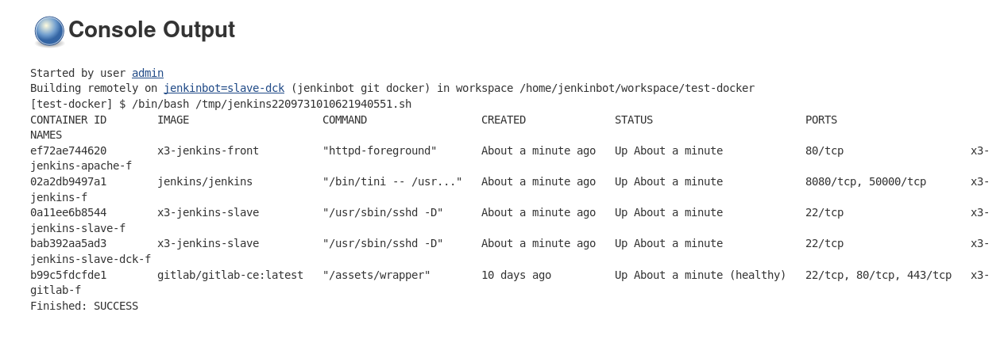
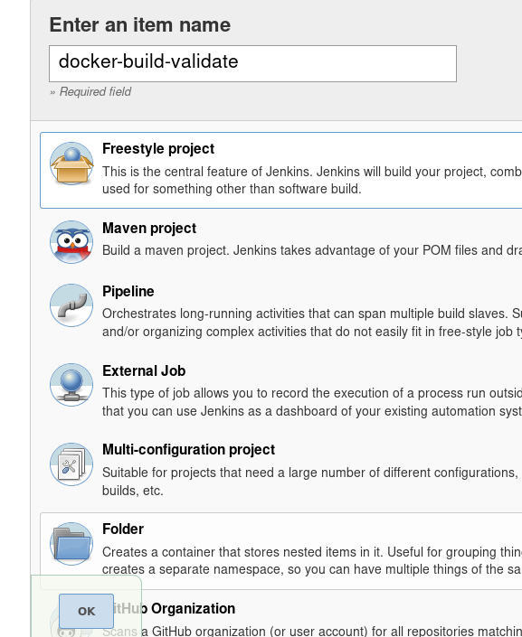
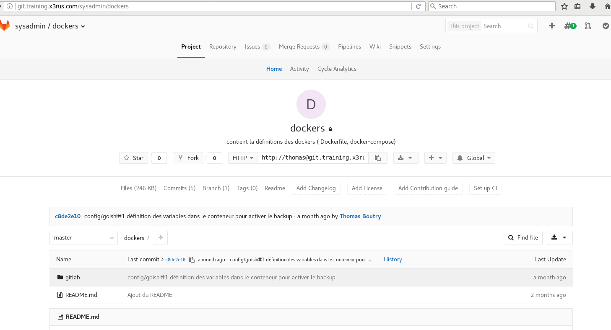
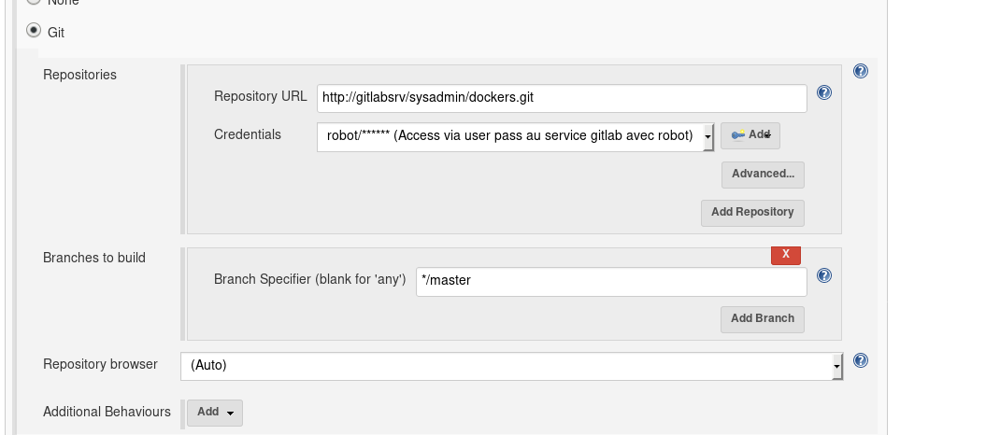
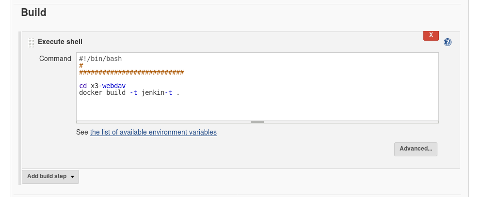
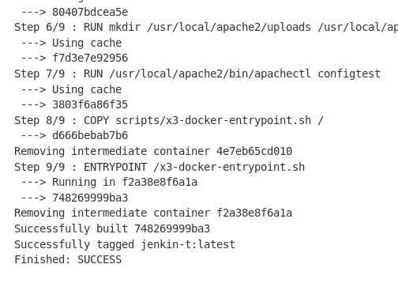

## Cas d'utilisation , conteneur docker

Nous avons vue la mise en place de Jenkins, la mise en place d'un serveur apache pour la sécurisation , l'intégration "SIMPLE" avec **gitlab** ainsi que la mise en place d'un slave. Bien entendu je pourrai continuer avec des exemples simple, mais j'ai envie d'aller plus loin en présentant des cas d'utilisations que vous pourriez mettre en place. 
Ceci risque de demander plus d'effort de compréhension selon votre niveau, mais on ira pas sur la lune !!! Accrochez vous , posez des questions sur internet ou autour de vous , essayez de l'expliquer à quelqu'un d'autre :P ( parfois ça l'aide) 

Voici la description du "**besoin**" : J'ai plusieurs conteneur que j'ai créé malheureusement faire des changement sur ces derniers est toujours délicat, car j'ai généralement du temps lors de leurs création, mais pour la mise à jour / modification la phase de teste est délicat. Résultat j'ose pas toujours y toucher , car ça marche puis la mise à jour c'est pas indispensable. En d'autre mot je m'expose à des risques de sécurité et je m'auto limite pour la suite. 
La solution mettre en place une système de validation lors de la création pour que le système réalise au moins l'ensemble des testes passant ... Ceci augmentera mon niveau de confiance pour une mise en production. Il faut comprendre, j'ai pas  des environnements de Dev / QA / Pre-prod / prod ... je suis tout seule :P .


Étape haut niveau pour la réalisation :

1. Lors de l'édition du dépôt Git contenant la définition de mes conteneurs qu'une tâches Jenkins ce déclenche
2. Jenkins extrait le dépôt et réalise une validation "syntaxique" et build le nouveau conteneur ( stop s'il y a un problème )
3. Si le nouveau conteneur à pu être créé avec succès réalisation de teste d'intégration / unit test
4. Si les testes sont un succès envoie du conteneur dans le registry privé docker ( Nous ne l'avons pas encore .... On le couvrira rendu là ou pas comme d'habitude :P )


### Requis pour la réalisation et contrainte 


Donc pour la réalisation de cette opération nous aurons besoin :

* Un slave qui a docker 
* Serveur gitlab 
    * avec des branches .
    * La configuration d'un webhook pour déclencher un build automatiquement.
    * Jenkins devra mettre à jour le dépôt suite au build.
    * Gestion des tags pour fixé une version.

Bien entendu l'ensemble avec des conteneurs.

Bon, nous parlons souvent de résistance au changement, nous prônons l'évolution, le changement des méthodes de travailles , etc . Dans la réalité j'ai été réfractaire dans le changement dans cette situation . Je l'assume pleinement, mais le bon côté nous/vous  pourrons/pourrez capitalisé sur ce travail. 
Je n'ai pas voulu changer l'organisation des mes conteneurs , aujourd'hui comme présenté j'ai un dépôt nommé **dockers** qui contient l'ensemble de la définition de mes conteneurs ( Jenkins, gitlab, webdav, .... ). J'ai donc UN sous-répertoire par conteneur.

```
dockers 
    |> x3-webdav
        |> Dockerfile
    |> x3-jenkins
        |> Dockerfile
    |> x3-gitlab
        |> Dockerfile
    |> ...
```

Il aurait été BEAUCOUP , mais BEAUCOUP plus facile de créer un projets par conteneur dans gitlab pour faire l'opération qui suit, je soulèverai les points quand on va le voir mais j'ai du faire un script pour la gestion. 


### Mise en place du slave avec la capacité de Docker

Plusieurs méthodes sont possible il existe un plugin dans Jenkins pour gérer les serveurs dockers , la communication ce fait via l'API de dockers qui peut être en TLS bien entendu. Je n'ai pas utiliser cette méthode, car dans la réalité je n'ai qu'un serveur docker de "production". Donc je n'ai pas voulu ouvrir le port de l'API de docker pour simplement faire un build et run ... Est-ce que j'aurais dû ?!?! Je pense qu'il y a des arguments pour , mais mon argument dans la situation est plus de gardé ça simple, voir simpliste :D .


Nous allons donc ajouter un autre conteneur slave pour la partie docker , bien entendu si vous avez une machine dédié pour faire l'opération pas besoin de vous prendre la tête simplement définir l'accès ssh de la machine . Vous assurer que la machine à bien docker et que l'ensemble fonctionne avec l'utilisateur associé à Jenkins .

Donc nous allons faire la modification suivante dans le [docker-compose.yml](./dockers/docker-compose-slabe-dck.yml)

```
[ ... OUTPUT COUPÉ ...]
    jenkins:
        image: jenkins/jenkins
        container_name : 'x3-jenkins-f'
        hostname: jenkins.train.x3rus.com
        environment:
            - TZ=America/Montreal
        volumes:
            - "/srv/docker/x3-jenkins-f/jenkins-data:/var/jenkins_home"
        links:
            - gitlab:gitlabsrv
            - jenkins-slave:jenkins-s1
            - jenkins-slave-dck:jenkins-s2
[ ... OUTPUT COUPÉ ...]
    jenkins-slave: 
        image: x3-jenkins-slave
        build: ./jenkins-slave/.
        container_name : 'x3-jenkins-slave-f'
        hostname : jenkins-slave.train.x3rus.com
        environment:
            - TZ=America/Montreal
        links:
            - gitlab:gitlabsrv 
    jenkins-slave-dck: 
        image: x3-jenkins-slave
        build: ./jenkins-slave/.
        container_name : 'x3-jenkins-slave-dck-f'
        hostname : jenkins-slave-dck.train.x3rus.com
        environment:
            - TZ=America/Montreal
        links:
            - gitlab:gitlabsrv 
        volumes:
            - /var/run/docker.sock:/var/run/docker.sock
            - /usr/bin/docker:/usr/bin/docker
[ ... OUTPUT COUPÉ ...]
```

Si nous regardons les 2 définitions des slaves elles sont presque pareille, sauf que le slave pour docker a la définition pour des volumes 

* **/var/run/docker.sock** : Socket pour les communications avec l'applicatif docker 
* **/usr/bin/docker** : Applicatif docker , binaire pour faire des opérations ...

De plus nous ajoutons le lien entre Jenkins et le nouveau slave.

C'est vraiment magnifique d'avoir rien d'autre a mettre en place pour qu'un conteneur soit en mesure d'utiliser docker DANS un conteneur :D , oui oui magie !!! Là on peut dire que c'est bien fait !! 

Pour les petits malin il y a un problème dans la configuration :P , ça marcherai PRESQUE , si vous avez envie d'analyser le problème je vous dis arrêter tout de suite et chercher le problème ... :D Nous pourrions voir ça comme un exercice . Nous allons mettre en place une tâche qui va utiliser ce conteneur et voir la problématique !!!


```bash
$ docker-compose up -d 
Starting x3-gitlab-f ... 
Starting x3-gitlab-f ... done
Starting x3-jenkins-slave-f ... 
Starting x3-jenkins-slave-f
Starting x3-jenkins-slave-f ... done
Creating x3-jenkins-slave-dck-f ... done
Recreating x3-jenkins-f2 ... 
Recreating x3-jenkins-f2 ... done
Recreating x3-jenkins-apache-f2 ... 
Recreating x3-jenkins-apache-f2 ... done
```

Donc même chemin que pour un slave "normale" **manage jenkins** --> **Manage Nodes** --> **add node** .
Comme nous avons déjà un node très similaire je vais réaliser une copie de la configuration puis la modifier ... 


J'ai donc modifier :

* La description 
* les étiquettes ( Label )
* le nom du host pour la connexion :D


Et voilà succès :D


Réalisons une tâche pour valider que ça fonctionne , mais ça marchera pas :P !! 


Section général , l'important dans cette section est vraiment l'utilisation du **label** docker:


Juste un petit docker __ps__ pour valider que la communication fonctionne !


Je lance le build , bon c'est vraiment drôle, car ce n'était pas l'erreur que je pensait avoir :P , on arrête pas le plaisir :D


#### Analyse erreur du slave

Bon rendu là je vais faire une section pour le correctif, car il y a au moins 2 problème , pour faire l'analyse du problème je vais me connecter dans le conteneur pour faire l'analyse .

L'erreur indique un problème avec les librairies partagé définie dans le binaire docker, je vais donc analyser s'il y a d'autre librairie manquante :

```bash
$ docker exec -it x3-jenkins-slave-dck-f bash
root@jenkins-slave-dck:/# apt-cache search ^C
root@jenkins-slave-dck:/# ldd /usr/bin/docker 
        linux-vdso.so.1 =>  (0x00007fff21ff8000)
        libpthread.so.0 => /lib/x86_64-linux-gnu/libpthread.so.0 (0x00007f40456c0000)
        libltdl.so.7 => not found
        libc.so.6 => /lib/x86_64-linux-gnu/libc.so.6 (0x00007f40452f7000)
        /lib64/ld-linux-x86-64.so.2 (0x00007f40458dd000)
```

C'est bon signe il n'y en a pas d'autre , installation de la librairie

```bash
root@jenkins-slave-dck:/# apt-cache search ltdl
libltdl-dev - System independent dlopen wrapper for GNU libtool
libltdl7 - System independent dlopen wrapper for GNU libtool
root@jenkins-slave-dck:/# apt-get install libltdl7
```

Comme je suis connecter validons que ça fonctionne : 

```bash
root@jenkins-slave-dck:/# docker  ps   
CONTAINER ID        IMAGE                     COMMAND                  STATUS                    PORTS                     NAMES
aae1b1a50383        x3-jenkins-front          "httpd-foreground"       Up 19 minutes             80/tcp                    x3-jenkins-apache-f
b8b77e2e8ea5        jenkins/jenkins           "/bin/tini -- /usr..."   Up 19 minutes             8080/tcp, 50000/tcp       x3-jenkins-f
ce21f1aa8efc        x3-jenkins-slave          "/usr/sbin/sshd -D"      Up 19 minutes             22/tcp                    x3-jenkins-slave-dck-f
a609350d6cd3        x3-jenkins-slave          "/usr/sbin/sshd -D"      Up 19 minutes             22/tcp                    x3-jenkins-slave-f
b99c5fdcfde1        gitlab/gitlab-ce:latest   "/assets/wrapper"        Up 19 minutes (healthy)   22/tcp, 80/tcp, 443/tcp   x3-gitlab-f
```

Bon faudra modifier la définition du conteneur, mais ça fonctionne avant de changer le Dockerfile , validons que la tâche fonctionne :D 
C'est bien maintenant j'ai l'erreur attendu :D :


Pourquoi, il y a ce problème de permissions ?? En fait le problème dans la définition de notre conteneur , l'exécution des commandes est réalisé avec l'utilisateur jenkinbot . Cependant l'utilisateur n'est pas membre du groupe docker donc le binaire __docker__ n'est pas en mesure d'établir une connexion au docker .

```bash
$ ls -l /var/run/docker.sock
srw-rw---- 1 root docker 0 Sep  1 17:05 /var/run/docker.sock

$ ls -ln /var/run/docker.sock 
srw-rw---- 1 0 994 0 Sep  1 17:05 /var/run/docker.sock 
```

Nous allons donc modifier la définition du conteneur pour ajouter **jenkinbot** au groupe dockers.

Résultat [Dockerfile](./dockers/jenkins-slave/Dockerfile-v2):

```
 # package 

 # Create default user "jenkinbot" with password toto
 # Ajout du groupe docker pour communiquer avec le docker host
 RUN useradd -s /bin/bash -m  jenkinbot && \
     echo "jenkinbot:toto" | chpasswd && \
     groupadd -g 994 docker && \
     usermod -G sudo,docker jenkinbot
```

On reconstruit l'image et on redémarrage le tous :D.

```bash
$ docker-compose build jenkins-slave-dck
[... OUTPUT COUPÉ ...]
Step 11/12 : EXPOSE 22                 
 ---> Running in af3c4aae8318          
 ---> 2a3a863af8ac                     
Removing intermediate container af3c4aae8318                                   
Step 12/12 : CMD /usr/sbin/sshd -D     
  ---> Running in 9bbd1e434c1e          
  ---> 718bdc09cca0                     
Removing intermediate container 9bbd1e434c1e                                   
Successfully built 718bdc09cca0        
Successfully tagged x3-jenkins-slave:latest 

$ docker-compose rm jenkins-slave-dck
Going to remove x3-jenkins-slave-dck-f
Are you sure? [yN] y
Removing x3-jenkins-slave-dck-f ... done

```

Validation de la configuration :

```
$ docker exec x3-jenkins-slave-f id jenkinbot
uid=1000(jenkinbot) gid=1000(jenkinbot) groups=1000(jenkinbot),27(sudo),994(docker)
```

Résultat à l'exécution de notre tâche :



### Création de la tâche intégration Gitlab , compilation de l'image Docker

Je sais maintenant on maîtrise l'intégration __gitlab__, mais on va juste faire une révision .
Voici ce que nous allons faire dans cette section :

1. Création de la tâche qui nous servira par la suite 
2. Récupération du dépôt avec la définition du conteneur
3. Compilation d'une image docker avec la définition extraite du dépôt 

Nous allons encore utiliser la tâche de type **FreeStyle** nous aurons les coudés franches .

 

Lors de la présentation j'avais déjà un dépôt **git** pour des conteneurs :



Je vais donc ajouter l'utilisateur **robot** pour qu'il soit en mesure de communiquer avec ce dépôt .


Je vais ajouter une définition docker dans le dépôt pour avoir du matériel à compiler ( générer l'image )

```bash
$ git clone http://thomas@git.training.x3rus.com/sysadmin/dockers.git 
Cloning into 'dockers'...
Password for 'http://thomas@git.training.x3rus.com': 
remote: Counting objects: 18, done.
remote: Compressing objects: 100% (13/13), done.
remote: Total 18 (delta 2), reused 0 (delta 0)
Unpacking objects: 100% (18/18), done.

$ mkdir x3-webdav && cd x3-webdav
$ ls
docker-compose.yml  Dockerfile  README.md  scripts

$ cd .. && git add x3-webdav
$ git commit -a -m "Ajout du conteneur webdav"
$ git push origin master
```

[Fichier tar.gz](./data/x3-webdav-basic.tar.gz) contenant le contenue du docker.

Donc nous avons une définition d'image disponible , et l'utilisateur **robot** peut y accéder ! 

Ajoutons ceci dans la définition de notre tâche :



N'oubliez pas la restriction d'exécution :


On met une définition juste pour être certain que ça passe quelque chose de simple :



On exécute et on admire :D 



Donc nous sommes en mesure d'en Jenkins de réaliser la compilation d'une image docker sans problème . 
Nous voulions être aussi en mesure de réaliser un validation de notre image lors de la compilation , en d'autre mot un test unitaire.


### Création d'un système de validation du conteneur

Lors de la présentation DevOps j'avais insisté sur l'aspect de validation , de mise en place de teste unitaire préalable au déploiement. J'avais mentionné que ceci est principalement du côté du développement. Pour ce qui est des testes unitaire effectivement c'est plus pour l'équipe de développement par contre le côté test d'intégration nous incombe . Prenons l'exemple d'un conteneur pour le service **webdav**, quelle type de validation puis je réaliser ?

Pour rappel un service **webdav** est : 

> WebDAV (Web-based Distributed Authoring and Versioning) est un protocole (plus précisément, une extension du protocole HTTP) défini par le groupe de travail IETF du même nom. Décrit dans la RFC 49181, WebDAV permet de simplifier la gestion de fichiers avec des serveurs distants. Il permet de récupérer, déposer, synchroniser et publier des fichiers (et dossiers) rapidement et facilement. L'objectif principal de WebDAV est de rendre possible l'écriture à travers le web et pas seulement la lecture de données. WebDAV permet à plusieurs utilisateurs d'éditer le contenu d'un dossier web simultanément. Il saura gérer les droits d'accès aux fichiers (ou dossiers), en verrouillant momentanément les fichiers et dossiers édités.

Référence : [wikipedia webdav](https://fr.wikipedia.org/wiki/WebDAV)

Voici ce que nous allons valider, j'ai mis en place une liste de validation sur mon conteneur qui sont regroupés par type , je vais lister à haut niveau les validation. Bien entendu ceci évoluera dans le temps avec l'ajout de fonctionnalités

* TestWebDavContainer : Test sur le conteneur webdav avec une utilisateur valide ...
    * setUp : Initialisation pour le début du test , définition URL , utilisateur , mot de passe, ...
    * 01_CreateDirectory : Création d'un répertoire 
    * 02_UploadFile : Upload d'un fichier dans le répertoire
    * 03_ListDirectoy : Liste les fichiers contenu dans le répertoire 
    * 04_DownloadFile : Téléchargement du fichier et validation du hash afin de valider que le fichier est le même que lors de l'envoie
    * 05_BadLoginGetFile : Récupération d'un fichier qui n'existe pas 
* TestWebDavContainerBadLogin : Test sur le conteneur webdav avec une erreur d'authentification , l'ensemble des testes si dessus ne doivent PAS fonctionner.
    * setUp : Initialisation pour le début du test , définition URL , utilisateur , ...
    * 01_CanNotCreateDirectory : Création d'un répertoire alors que l'authentification est mauvaise
    * 02_CanNotListFile : Récupération de la liste des fichiers 
* TestWebDavContainerAnonymous : Test du le conteneur webdav en mode anonyme, l'ensemble des testes ne doivent pas fonctionner.
    * setUp : Initialisation pour le début du test , définition URL .
    * 01_CanNotCreateDirectory : Création d'un répertoire en mode anonyme 
    * 02_CanNotListFile : Liste des fichiers disponible.


Comme vous pouvez le voir il y a 3 bloques selon la situation , chaque bloque comprend une initialisation de l'environnement et des testes . 
Le script python est [data/webdav-validation.py](./data/webdav-validation.py) 

Lors de la présentation de la formation sur YouTube je prendrais un peu de temps pour décortiquer le scripts !

Ce script peut être utilisé de n'importe quelle manière , si vous regardez le script comprend la variable avec l'URL :

```python
 #############
 # Variables #
URL = "http://webdav"

```

Mais comme on aime les conteneurs, franchement à outrance pourquoi ne pas mettre ce script dans un conteneur :D , résultat un aura un conteneur qui valide un conteneur :P . Bon si vous me dites ou mais qui valide le conteneur qui valide le conteneur ... je rigole et ne répond pas :P .

#### Conteneur de validation pour webdav (x3-webdav-cli)

Pour les personnes qui disent que j'utilise trop docker je vais dire oui peut-être, mais ceci permet d'avoir plusieurs cas d'utilisation !! Ça augmente l'intérêt de plus ceci offre une grande opportunité de packaging de l'application. Bon fini l'introduction, on se lance dans le Dockerfile. 

Voici le Dockerfile brute [Dockerfile](./dockers/x3-webdav/validations/integration-testing/webdav-cli/Dockerfile) 

```
 # Description : Test client webdav 
 #
 # Author : Thomas Boutry <thomas.boutry@x3rus.com>
 # Licence : GPLv3+

FROM python:3.5
MAINTAINER Thomas Boutry "thomas.boutry@x3rus.com"

ENV DEBIAN_FRONTEND noninteractive

RUN mkdir /x3-apps/
COPY apps/requirements.txt /x3-apps/
RUN pip install --no-cache-dir -r /x3-apps/requirements.txt

COPY apps/* /x3-apps/

CMD ["python3", "/x3-apps/webdav-validation.py", "-v" ]
```

Donc rien de bien sorcier , ceci est un conteneur python classique pour une application :

* Image : J'utilise l'image officiel de référence python 3.5
* Application : Installation de l'application dans le répertoire **/x3-apps**  et j'utilise la définition des dépendances avec le fichier __requirements__ qui sera utilisé par l'application **pip**.
* Commande : Je démarre le script ( application ) en mode verbose 

Bien entendu afin d'orchestrer l'ensemble on va utiliser un petit [docker-compose.yml](./validations/integration-testing/docker-compose.yml) !

```
version: '2'
services:
    x3-webdav:
        image: my_private_registry/user/x3-webdav:build
        build: ../../
        container_name : 'x3-webdav-build'
        hostname: webdav.x3rus.com
        environment:
            - TERM=xterm
            - TZ=America/Montreal
            - USERS_PASS=thomas=toto
 
    x3-webdav-cli:
        image: my_private_registry/user/x3-webdav-int-validation:build
        build: webdav-cli/.
        container_name : 'x3-webdav-int-validation-b'
        hostname: webdav-cli.x3rus.com
        environment:
            - TERM=xterm
            - TZ=America/Montreal
        links:
            - x3-webdav:webdav
```

Donc nous avons 2 conteneurs le conteneur **x3-webdav** et le conteneur **x3-webdav-cli** .

* **x3-webdav** : Ce conteneur sera compilé afin de générer l'image , comme vous pouvez le voir le **PATH** du build est relatif définie dans 2 répertoire supérieur. Le nom de l'image dans la situation est **x3-webdav:build** , j'ai opté pour un nom différent afin de générer l'image sous un tag différent que le classique **latest** . Ce que je voulais m'assurer est que cette image ne sera jamais utilisé pour une utilisation en "production" . L'utilisation du tag **latest** est parfois utilisé car c'est celui par défaut. 

* **x3-webdav-cli** : Il y a le lien entre le conteneur de validation et le conteneur à valider :P ( __x3-webdav__ ) 

Voyons un peu le comportement quand on veut faire un teste , c'est partie :

```bash
$ cd dockers/x3-webdav/validations/integration-testing
$ docker-compose build                                                
Building x3-webdav                     
Step 1/9 : FROM httpd:2.4              
 ---> 50f10ef90911   
[ ... OUTPUT COUPE ... ]
 ---> f35226f62936                     
Removing intermediate container 1b36ecccf08d                                   
Successfully built f35226f62936        
Successfully tagged my_private_registry/user/x3-webdav-int-validation:build 

$ # démarrage du conteneur avec le service webdav

$ docker-compose up -d x3-webdav 
Creating x3-webdav-build ...           
Creating x3-webdav-build ... done   

$ docker ps                   
CONTAINER ID        IMAGE                                      COMMAND                  STATUS              PORTS               NAMES     
a76031aed37e        my_private_registry/user/x3-webdav:build   "/x3-docker-entryp..."   Up 1 second         80/tcp              x3-webdav-build           

$ # Je lance la validation du conteneur 

$ docker-compose run x3-webdav-cli                                    
Starting x3-webdav-build ... done      
test_01_CreateDirectory (__main__.TestWebDavContainer) ... ok                  
test_02_UploadFile (__main__.TestWebDavContainer) ... <!DOCTYPE HTML PUBLIC "-//IETF//DTD HTML 2.0//EN">                                                      
<html><head>                           
<title>201 Created</title>             
</head><body>                          
<h1>Created</h1>                       
<p>Resource /uploads/intergrationTesting/tux.png has been created.</p>
</body></html>
ok                                     
test_03_ListDirectoy (__main__.TestWebDavContainer) ... ok                     
test_04_DownloadFile (__main__.TestWebDavContainer) ... ok                     
test_05_BadLoginGetFile (__main__.TestWebDavContainer) ... ok                  
test_01_CanNotCreateDirectory (__main__.TestWebDavContainerAnonymous) ... ok   
test_02_CanNotListFile (__main__.TestWebDavContainerAnonymous) ... ok          
test_01_CanNotCreateDirectory (__main__.TestWebDavContainerBadLogin) ... ok    
test_02_CanNotListFile (__main__.TestWebDavContainerBadLogin) ... ok           

----------------------------------------------------------------------         
Ran 9 tests in 0.188s                  

OK                         

$ docker ps                   
CONTAINER ID        IMAGE                                      COMMAND                  STATUS              PORTS               NAMES
a76031aed37e        my_private_registry/user/x3-webdav:build   "/x3-docker-entryp..."   Up About a minute   80/tcp              x3-webdav-build

```

Comme vous pouvez le constater , j'ai utiliser l'instruction **docker-compose run** pour faire une exécution juste une fois du conteneur, pour la validation du système. 
Nous voyons dans la description ci-dessus que tous à bien fonctionné !

Donc nous avons notre conteneur de validation et nous avons confirmer que l'ensemble fonctionne à merveille !! Cependant pour le moment nous sommes dans une mécanique manuelle de validation. Nous allons maintenant voir comment j'ai réalisé l'intégration avec Jenkins. 

### Explication de la mécanique , la logique , le flux , workflow 

Bon je savais pas quoi mettre comme titre j'ai tous mis :P . Cette section est plus important que la réalisation proprement dite , car c'est ici la compréhension , la mécanique pur dans le script n'est vraiment que les instructions de la logique définie préalablement !!

**Rappel de l'objectif** : Je veux que le conteneur **x3-webdav** soit valider lorsqu'il y a des modifications dans ça définition que ce soit le contenu du __Dockerfile__ , le script de démarrage , fichier de configuration , ... De plus je désire que le conteneur final soit transmis à mon docker __registry__ privé. La définition du conteneur **x3-webdav** est dans un projet **git** contenant plusieurs définition de conteneur (x3-gitlab, x3-jenkins, ... ).

En utilisant __git__ nous avons la puissance de la décentralisation des __commits__ les informations des modifications arrivent dans la branche par __batch__ que ce soit par un push classique ou un __merge request__. Résultat il est possible que lors de la réception des données plusieurs répertoire de définition de conteneur soit inclut .

Le concept au niveau est : 

1. Lors de la réalisation __push__ ou __merge__ requête au serveur git le système va démarrer automatiquement la tâche Jenkins 
2. La tâches Jenkins aura plusieurs paramètres telle que : 
    * la liste des répertoires à traiter (exemple : faire le traitement pour x3-webdav uniquement , aucune opération s'il y a eu une modification pour x3-jenkins.
    * Ne réalise pas le traitement si le commit fut réalisé par une **robot** ( exemple : robot )
    * Exclusion des commit réalisé antérieur à une date donnée.
2. La tâches Jenkins va extraire le script pour la tâches depuis __gitlab__
3. Le système va donc parcourir les logs des commit afin d'identifier si la compilation est requise. Selon les critères :
    * Nom de l'utilisateur n'est pas exclut.
    * Le répertoire est bien inclus ou exclut de la liste à prendre en considération.
    * Le numéro de commit dans le répertoire ne fut pas déjà traité lors d'un build précédent.
    * Le message du commit n'est pas identifier à être exclut !
4. Lors de la compilation de l'image de validation, nous n'utiliserons pas le tag par défaut (__latest__) mais **build** l'objectif est que si nous sommes en train de valider un conteneur qui est en exécution sur la machine , il n'y aura pas "conflit" ou d'écrasement de l'image actuellement en utilisation.
5. Si la compilation fonctionne, il y a une phase de test avec le __unittest__  précédemment présenté.
6. Si le unit test fut un success une nouvelle compilation est réaliser pour générer le build avec le tag **latest** , car il y a eu validation du fonctionnement.
7. Le script va mettre en place un fichier de configuration avec le dernier numéro de commit réalisé avec succès, indiquant le dernière commit qui fut compilé avec succès , ce fichier sera commité et poussé au serveur git. L'objectif est de m'assurer qu'il n'y aura pas plusieurs compilation pour les même tâches.
8. Pousse l'image dans le docker registry

Voici une représentation graphique du résultat :


Bon là , je vois les yeux puis certain ce disent , woww il s'est vraiment fait chier pour mettre en place toute cette mécanique !! La réalisation de l'ensemble du processus fut long , et vous savez quoi je ne suis pas content de la solution que je vais vous présenter :P . Je travaille sur une autre version amélioré ou du moins différente :D, mais c'est une autre histoire. 

Il faut le voir comme un processus d'apprentissage , de plus si je met une mécanique qui augmentera mon niveau de confiance lors de changement des mes conteneur . Après j'ai pris combien de temps ?? Nous allons dire 2 semaines , 5 jours semaine 2 heures par jours , ça ne fait que (2 x 5)x 2 = 20 heures . C'est juste 2 séries de qualité discutables sur Netflix :P , que celui qui n'a jamais écouté une série au complet même si c'était moyen juste parce que on l'avait commencé :D . Sauf que dans la situation présente j'en ressort avec plus de connaissance et une mécanique en place qui me servira dans le temps :D.
C'est pas pire que faire des formations sur Youtube gratuitement pour aider les gens à progresser :P .

### Mise en place de la solution !!


