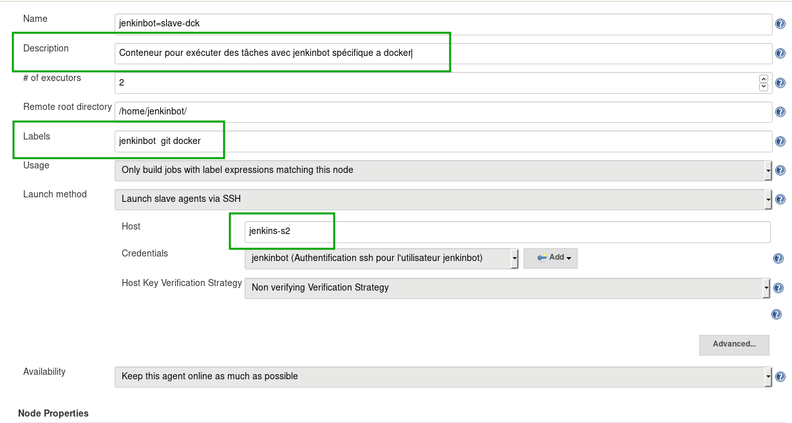
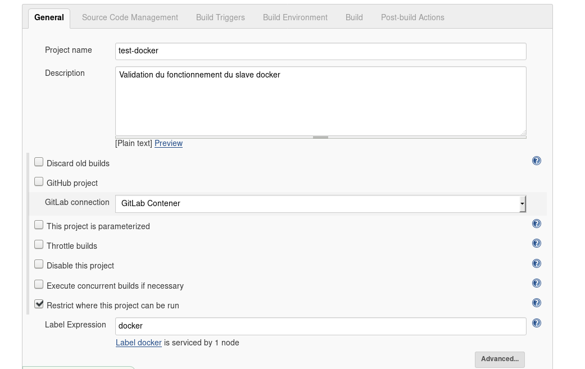
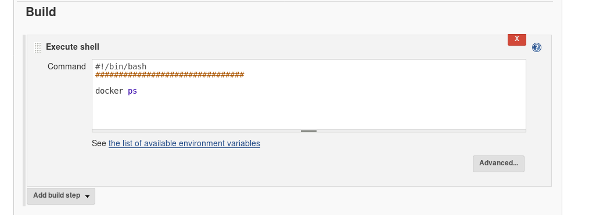

## Cas d'utilisation , conteneur docker

Nous avons vue la mise en place de Jenkins, la mise en place d'un serveur apache pour la sécurisation , l'intégration "SIMPLE" avec **gitlab** ainsi que la mise en place d'un slave. Bien entendu je pourrai continuer avec des exemples simple, mais j'ai envie d'aller plus loin en présentant des cas d'utilisations que vous pourriez mettre en place. 
Ceci risque de demander plus d'effort de compréhension selon votre niveau, mais on ira pas sur la lune !!! Accrochez vous , posez des questions sur internet ou autour de vous , essayez de l'expliquer à quelqu'un d'autre :P ( parfois ça l'aide) 

Voici la description du "**besoin**" : J'ai plusieurs conteneur que j'ai créé malheureusement faire des changement sur ces derniers est toujours délicat, car j'ai généralement du temps lors de leurs création, mais pour la mise à jour / modification la phase de teste est délicat. Résultat j'ose pas toujours y toucher , car ça marche puis la mise à jour c'est pas indispensable. En d'autre mot je m'expose à des risques de sécurité et je m'auto limite pour la suite. 
La solution mettre en place une système de validation lors de la création pour que le système réalise au moins l'ensemble des testes passant ... Ceci augmentera mon niveau de confiance pour une mise en production. Il faut comprendre, j'ai pas  des environnements de Dev / QA / Pre-prod / prod ... je suis tout seule :P .


Étape haut niveau pour la réalisation :

1. Lors de l'édition du dépôt Git contenant la définition de mes conteneurs qu'une tâches Jenkins ce déclenche
2. Jenkins extrait le dépôt et réalise une validation "syntaxique" et build le nouveau conteneur ( stop s'il y a un problème )
3. Si le nouveau conteneur à pu être créé avec succès réalisation de teste d'intégration / unit test
4. Si les testes sont un succès envoie du conteneur dans le registry privé docker ( Nous ne l'avons pas encore .... On le couvrira rendu là ou pas comme d'habitude :P )


### Requis pour la réalisation et contrainte 


Donc pour la réalisation de cette opération nous aurons besoin :

* Un slave qui a docker 
* Serveur gitlab 
    * avec des branches .
    * La configuration d'un webhook pour déclencher un build automatiquement.
    * Jenkins devra mettre à jour le dépôt suite au build.
    * Gestion des tags pour fixé une version.

Bien entendu l'ensemble avec des conteneurs.

Bon, nous parlons souvent de résistance au changement, nous prônons l'évolution, le changement des méthodes de travailles , etc . Dans la réalité j'ai été réfractaire dans le changement dans cette situation . Je l'assume pleinement, mais le bon côté nous/vous  pourrons/pourrez capitalisé sur ce travail. 
Je n'ai pas voulu changer l'organisation des mes conteneurs , aujourd'hui comme présenté j'ai un dépôt nommé **dockers** qui contient l'ensemble de la définition de mes conteneurs ( Jenkins, gitlab, webdav, .... ). J'ai donc UN sous-répertoire par conteneur.

```
dockers 
    |> x3-webdav
        |> Dockerfile
    |> x3-jenkins
        |> Dockerfile
    |> x3-gitlab
        |> Dockerfile
    |> ...
```

Il aurait été BEAUCOUP , mais BEAUCOUP plus facile de créer un projets par conteneur dans gitlab pour faire l'opération qui suit, je soulèverai les points quand on va le voir mais j'ai du faire un script pour la gestion. 


### Mise en place du slave avec la capacité de Docker

Plusieurs méthodes sont possible il existe un plugin dans Jenkins pour gérer les serveurs dockers , la communication ce fait via l'API de dockers qui peut être en TLS bien entendu. Je n'ai pas utiliser cette méthode, car dans la réalité je n'ai qu'un serveur docker de "production". Donc je n'ai pas voulu ouvrir le port de l'API de docker pour simplement faire un build et run ... Est-ce que j'aurais dû ?!?! Je pense qu'il y a des arguments pour , mais mon argument dans la situation est plus de gardé ça simple, voir simpliste :D .


Nous allons donc ajouter un autre conteneur slave pour la partie docker , bien entendu si vous avez une machine dédié pour faire l'opération pas besoin de vous prendre la tête simplement définir l'accès ssh de la machine . Vous assurer que la machine à bien docker et que l'ensemble fonctionne avec l'utilisateur associé à Jenkins .

Donc nous allons faire la modification suivante dans le [docker-compose.yml](./dockers/docker-compose-slabe-dck.yml)

```
[ ... OUTPUT COUPÉ ...]
    jenkins:
        image: jenkins/jenkins
        container_name : 'x3-jenkins-f'
        hostname: jenkins.train.x3rus.com
        environment:
            - TZ=America/Montreal
        volumes:
            - "/srv/docker/x3-jenkins-f/jenkins-data:/var/jenkins_home"
        links:
            - gitlab:gitlabsrv
            - jenkins-slave:jenkins-s1
            - jenkins-slave-dck:jenkins-s2
[ ... OUTPUT COUPÉ ...]
    jenkins-slave: 
        image: x3-jenkins-slave
        build: ./jenkins-slave/.
        container_name : 'x3-jenkins-slave-f'
        hostname : jenkins-slave.train.x3rus.com
        environment:
            - TZ=America/Montreal
        links:
            - gitlab:gitlabsrv 
    jenkins-slave-dck: 
        image: x3-jenkins-slave
        build: ./jenkins-slave/.
        container_name : 'x3-jenkins-slave-dck-f'
        hostname : jenkins-slave-dck.train.x3rus.com
        environment:
            - TZ=America/Montreal
        links:
            - gitlab:gitlabsrv 
        volumes:
            - /var/run/docker.sock:/var/run/docker.sock
            - /usr/bin/docker:/usr/bin/docker
[ ... OUTPUT COUPÉ ...]
```

Si nous regardons les 2 définitions des slaves elles sont presque pareille, sauf que le slave pour docker a la définition pour des volumes 

* **/var/run/docker.sock** : Socket pour les communications avec l'applicatif docker 
* **/usr/bin/docker** : Applicatif docker , binaire pour faire des opérations ...

De plus nous ajoutons le lien entre Jenkins et le nouveau slave.

C'est vraiment magnifique d'avoir rien d'autre a mettre en place pour qu'un conteneur soit en mesure d'utiliser docker DANS un conteneur :D , oui oui magie !!! Là on peut dire que c'est bien fait !! 

Pour les petits malin il y a un problème dans la configuration :P , ça marcherai PRESQUE , si vous avez envie d'analyser le problème je vous dis arrêter tout de suite et chercher le problème ... :D Nous pourrions voir ça comme un exercice . Nous allons mettre en place une tâche qui va utiliser ce conteneur et voir la problématique !!!


```bash
$ docker-compose up -d 
Starting x3-gitlab-f ... 
Starting x3-gitlab-f ... done
Starting x3-jenkins-slave-f ... 
Starting x3-jenkins-slave-f
Starting x3-jenkins-slave-f ... done
Creating x3-jenkins-slave-dck-f ... done
Recreating x3-jenkins-f2 ... 
Recreating x3-jenkins-f2 ... done
Recreating x3-jenkins-apache-f2 ... 
Recreating x3-jenkins-apache-f2 ... done
```

Donc même chemin que pour un slave "normale" **manage jenkins** --> **Manage Nodes** --> **add node** .
Comme nous avons déjà un node très similaire je vais réaliser une copie de la configuration puis la modifier ... 


J'ai donc modifier :

* La description 
* les étiquettes ( Label )
* le nom du host pour la connexion :D




Et voilà succès :D


Réalisons une tâche pour valider que ça fonctionne , mais ça marchera pas :P !! 


Section général , l'important dans cette section est vraiment l'utilisation du **label** docker:



Juste un petit docker __ps__ pour valider que la communication fonctionne !



Je lance le build , bon c'est vraiment drôle, car ce n'était pas l'erreur que je pensait avoir :P , on arrête pas le plaisir :D


#### Analyse erreur du slave

Bon rendu là je vais faire une section pour le correctif, car il y a au moins 2 problème , pour faire l'analyse du problème je vais me connecter dans le conteneur pour faire l'analyse .

L'erreur indique un problème avec les librairies partagé définie dans le binaire docker, je vais donc analyser s'il y a d'autre librairie manquante :

```bash
$ docker exec -it x3-jenkins-slave-dck-f bash
root@jenkins-slave-dck:/# apt-cache search ^C
root@jenkins-slave-dck:/# ldd /usr/bin/docker 
        linux-vdso.so.1 =>  (0x00007fff21ff8000)
        libpthread.so.0 => /lib/x86_64-linux-gnu/libpthread.so.0 (0x00007f40456c0000)
        libltdl.so.7 => not found
        libc.so.6 => /lib/x86_64-linux-gnu/libc.so.6 (0x00007f40452f7000)
        /lib64/ld-linux-x86-64.so.2 (0x00007f40458dd000)
```

C'est bon signe il n'y en a pas d'autre , installation de la librairie

```bash
root@jenkins-slave-dck:/# apt-cache search ltdl
libltdl-dev - System independent dlopen wrapper for GNU libtool
libltdl7 - System independent dlopen wrapper for GNU libtool
root@jenkins-slave-dck:/# apt-get install libltdl7
```

Comme je suis connecter validons que ça fonctionne : 

```bash
root@jenkins-slave-dck:/# docker  ps   
CONTAINER ID        IMAGE                     COMMAND                  STATUS                    PORTS                     NAMES
aae1b1a50383        x3-jenkins-front          "httpd-foreground"       Up 19 minutes             80/tcp                    x3-jenkins-apache-f
b8b77e2e8ea5        jenkins/jenkins           "/bin/tini -- /usr..."   Up 19 minutes             8080/tcp, 50000/tcp       x3-jenkins-f
ce21f1aa8efc        x3-jenkins-slave          "/usr/sbin/sshd -D"      Up 19 minutes             22/tcp                    x3-jenkins-slave-dck-f
a609350d6cd3        x3-jenkins-slave          "/usr/sbin/sshd -D"      Up 19 minutes             22/tcp                    x3-jenkins-slave-f
b99c5fdcfde1        gitlab/gitlab-ce:latest   "/assets/wrapper"        Up 19 minutes (healthy)   22/tcp, 80/tcp, 443/tcp   x3-gitlab-f
```

Bon faudra modifier la définition du conteneur, mais ça fonctionne avant de changer le Dockerfile , validons que la tâche fonctionne :D 
C'est bien maintenant j'ai l'erreur attendu :D :


