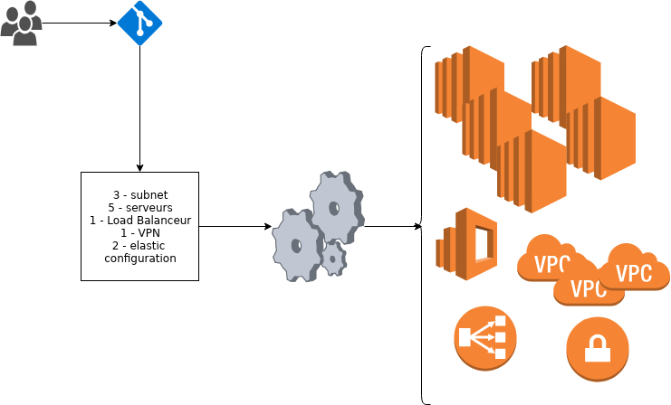
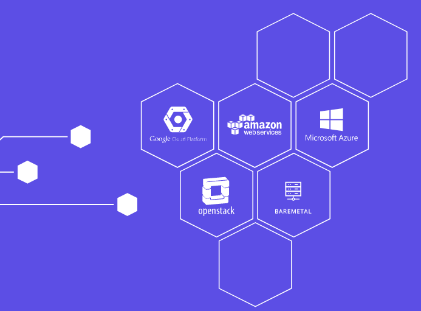

# Introduction / Présentation

**Infrastructure as Code (IaC)** est le concept de gérer et provisionner des machines au sein d'un centre de données uniquement à l'aide de fichiers de définition plutôt qu'une configuration manuelle, à travers des interfaces interactives ou physiquement. Le périmètre du système d'information (SI) couvert par ces techniques peuvent aller des équipements eux-mêmes ("bare metal") aux machines virtuelles et leurs ressources associées (sous le format de configurations sur l'hyperviseur). L'ensemble des fichiers de définitions peuvent bénéficier d'un système de gestion de versions (GIT, SVN , ...). 

Le concept d'IaC est né du besoin des entreprises à répondre efficacement à la transformation des architectures logicielles, devenues orientées web et pouvant être mises à l'échelle. La problématique d'alignement des ressources physiques aux besoins applicatifs était auparavant une problématique de grande entreprise informatique, elle s'est élargie à toute activité dont le service grandit.

C'est en 2006 qu'Amazon Web Services (AWS) introduit le concept durant la présentation d'Elastic Compute Cloud et de la première version de Ruby on Rails quelques mois auparavant. L'apparition rapide de nouveaux outils d'orchestration qui suivit l'essor de ce marché porteur a permis au concept d'Infrastructure as Code de faire sens et de se développer au sein des acteurs d'architectures redimensionnables

En d'autre mots, à l'aide d'un fichier texte, il est possible de définir l'ensemble de l'infrastructure , que celle-ci soit infonuagique (cloud) ou sur site. 

Les avantages sont nombreux : 

* Possible de versionner  la configuration de l'infrastructure avec le contrôler de révision, avec une source de référence pour savoir la configuration en place . ( + tous les avantages du contrôler de révision ).
* Normalisé la configuration de l'infrastructure d'un environnement en réutilisant la définition ( fichier text).
    * Correction d'inconsistance entre les environnements
* Permettre le déploiement rapide , car automatisé d'environnement.
* Possibilité d'orchestrer les déploiements.
* Réduction du risque d'un déploiement car tous comme du code il est possible de le tester préalablement et réduit les erreurs humaines.

## Les options  disponible

À ce jour les options sont nombreuses ( [List of Configuration](https://xebialabs.com/the-ultimate-devops-tool-chest/the-ultimate-list-of-configuration/) ) , la question est laquelle choisir. 

Lors d'échange avec mon entourage, clairement un élément influent, j'ai 2 joueurs qui se démarque :

* [Terraform](https://www.terraform.io/) : il existe depuis plusieurs année personnellement je l'avais boudé, car il ne supporté QUE **AWS**, je pense qu'une solution de ce type doit être utilisable pour plusieurs fournisseurs de service. À ce jour ce problème fut corrigé , maintenant il supporte un grand nombre de [module ou provider](https://www.terraform.io/docs/providers/index.html)

    * 

* [Ansible](https://www.ansible.com/) : Ansible est une plate-forme logicielle libre pour la configuration et la gestion des ordinateurs. Elle combine le déploiement de logiciels multi-nœuds, l'exécution des tâches ad-hoc, et la gestion de configuration. Ansible a aussi de nombreux [modules](https://docs.ansible.com/ansible/2.7/modules/modules_by_category.html) 

* [Puppet](https://puppet.com/fr) : Puppet est un logiciel libre permettant la gestion de la configuration de serveurs esclaves (GNU/Linux, Mac OS X et Windows). Puppet est écrit à l'aide du langage de programmation Ruby et est diffusé sous licence Apache 2.0 pour les versions récentes de Puppet. Les versions plus anciennes (inférieures à la V2.7.0), sont sous licence GPL3. 

* [Chef](https://www.chef.io/chef): Chef est un logiciel libre de gestion de configuration écrit en Ruby. Il utilise un langage dédié (appelé domain-specific language ou DSL) en pure-Ruby pour l'écriture de configuration du système d'exploitation sous la forme de « recettes » (recipes) ou de « livres de recettes » (cookbook)

## Que choisir ?

Comme je dis souvent trop de choix perd le client, dans le monde de l'opensource c'est d'autant plus vraie de par les choix multiples. Nous allons essayer avec le peu d'expérience que j'ai de répondre à cette question :P. Comme le nom de la formation est **Terraform** la conclusion est déjà connu :P, je vais essaye de développer la raison de ce choix qui est le fruit de recherche et non d'une expérience.

### Gestion de configuration vs orchestration

Si nous prenons __Puppet__ , __ansible__ , __chef__ , etc ces logiciels furent conçus dans l'idée de faire un déploiement d'une configurations sur un serveur existant :
    * Installation de packages
    * Création fichier / répertoire
    * Exécution de scripts 
    * ... 

Bien entendu avec le temps afin de répondre à une demande des utilisateurs certain modules furent ajouté afin de permettre la création d'instance EC2 (AWS) par exemple. 

De l'autre côté **Terraform** fut conĉu dans l'idée de permettre l'orchestration ou la création de l'infrastructure , il est possible de faire un peut de configuration avec **terraform** mais ce n'est pas ça force première. Comme nous le verrons plus loin **Terraform** est en mesure de faire l'appel de gestionnaire de configuration pour provisionner les systèmes créé. 

Une utilisation idéal pour **Terraform** est la cohabitation avec des systèmes telle que Docker / Kubernetes , vous avez besoin d'un orchestrateur de création et déploiement de vos conteneurs, mais l'utilisation d'un gestionnaire de configuration n'est plus requis, car l'ensemble est dans l'image du conteneur. Il y a un tutorial sur pour [Kubernetes avec terraform](https://www.terraform.io/docs/providers/kubernetes/guides/getting-started.html).

### Infrastructure Mutable vs Infrastructure Immutable

Moins pertinent mais on va le faire tout de même afin de faire une présentation de la différence entre les différent mode des logiciels. Donc les applications de type gestionnaire de configuration (__Ansible__, __Puppet__ , __Chef__ , ...), vont faire évolué la configuration d'un système. Résultat la modification des configurations vont s'ajouter au furent et à mesure sur le système . Ceci est donc une configuration mutable, la problématique ou le risque avec ce mode de fonctionnement est que chaque serveur auront une évolution différente au fur et à mesure que vous appliquez des règles. Bien entendu, nous essayons d'être strict sur les applications, cependant parfois ça glisse , sans parlé d'intervention manuel parfois requise lors d'urgence.

Dans une infrastructure Immutable, nous allons lors du processus de modification recréer l'instance ( __docker__ , __vm__ , ...) pour faire le déploiement d'une nouvelle configuration. Sur papier j'en convient c'est bien beau, mais la réalité terrain est pas toujours aussi simple, si nous prenons des serveurs de base de donnée, l'instance maître peu être difficile a détruire et recréer sans impact sur la production. Il est donc important d'avoir aussi des logiciels et mécanisme qui sont en harmonie.
Pour que ceci soit possible il y a un requis important, si faire la création d'une nouvelle instance prends 2 jours , ceci est beaucoup trop long , les logiciel d'orchestration telle que **terraform** vous permettra d'avoir une système automatisé qui permet la création rapide d'instance.
À titre d'exemple dans la démonstration qui sera réalisée à la suite de la présentation, en 6 minutes nous aurons :

* 2 clé SSH dans AWS
* 1 Réseau privé 
* 2 Subnet réseaux
* 4 règle de firewall
* 3 machines virtuel EC2

L'ensemble entièrement configurer, serveur apache déployé , site web installé , base de donnée configurer et dump SQL chargé.

Attention, je ne dis pas que les outils de configuration ne sont pas en mesure de réaliser une configuration immutable, cependant lors philosophie original n'étais pas en ce sens.

### Déclarative contre Procédurale  

__Chef__ et __Ansible__ propose de une écriture Procédurale où l'administrateur(trice) doit rédigé l'ensemble des instructions pour atteindre un état.
__Puppet__ ou **Terraform** propose une écriture déclarative où vous définissez un état que vous désirez et le système réalisera les opérations requise afin de ce conformé au exigence.

Dans l'exemple ci-dessus , très simpliste j'en convient, nous voyons un exemple simple pour la création d'instance sur AWS entre __Ansible__ et **Terraform**. 

Description : 

# Référence 

* [Pourquoi utilise-t-on Terraform et non Chef, Puppet, Ansible, SaltStack ou CloudFormation ?](https://www.hebergeurcloud.com/pourquoi-utilise-t-on-terraform-et-non-chef-puppet-ansible-saltstack-ou-cloudformation/) : https://www.hebergeurcloud.com/pourquoi-utilise-t-on-terraform-et-non-chef-puppet-ansible-saltstack-ou-cloudformation/
* [Configuration Management vs Orchestration](https://blog.gruntwork.io/why-we-use-terraform-and-not-chef-puppet-ansible-saltstack-or-cloudformation-7989dad2865c) : https://blog.gruntwork.io/why-we-use-terraform-and-not-chef-puppet-ansible-saltstack-or-cloudformation-7989dad2865c

