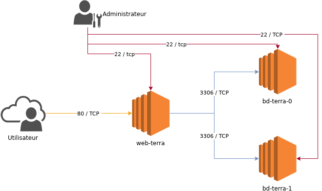

# Description

J'ai cherché quelle cas d'utilisation j'allais faire et comme nous allons utiliser AWS et que j'avais fait une présentation de AWS dans le passé j'ai pensé reprendre mon cas d'utilisation que j'avais fait manuellement. Ceci vous permettra aussi d'avoir la possibilité de voir la même opération en mode manuel. 
Ceci n'est PAS un requis mais un plus tout simplement , voici les liens :

* Texte :
    * 
* Vidéos (Playlist) :

Je vais donc commencé par présenté le cas d'utilisation qui est presque pareille que la dernière fois mais avec un petit changement il n'y aura pas de docker dans la solution présenté ici. J'avais utilisé docker la dernière fois pour simplifier mon déploiement applicatif , cependant dans le cas d'utilisation ici comme je veux utiliser __Ansible__ je désire avoir plus de complexité que simplement transmettre un conteneur.

## Présentation du cas d'utilisation

Voici donc le cas d'utilisation qui sera mis en place , Nous allons mettre un serveur GNU/Linux avec apache qui sera configurer pour 2 site web (virtual host) :

* contacts.x3rus.com
* showpi.x3rus.com

Ces 2 sites web utilise des bases de données pour stocker leurs données. Nous allons donc créer 2 serveur GNU/Linux avec Mysql :

* 1 pour le site contacts.x3rus.com
* 1 pour le site showpi.x3rus.com

Donc nous aurons 3 instances EC2 GNU/Linux ! 

Bien entendu, ces instances EC2 ont besoin d'une infrastructure autour , telle que les clé ssh pour être en mesure d'établir une connexion ; un réseau spécifique pour être en mesure d'isolé cette environnement des autres services et de rêgle de firewall afin de permettre la communication entre les services ainsi que l'exposition de services.

Voici une représentation graphique de l'ensemble des pièces du puzzle qui seront mise en place  :

 

De plus voici une représentation du flux réseau :



Je vais prendre le temps de les expliquer lors de leur création , cependant je voulais mettre en évidence que nous allons faire la création de plusieurs élément dans AWS. Nous ne couvrirons pas pour cette partie la mise en place du Elastic Load Balancer ou l'auto scaling automatique . Peut-être plus tard l'avenir est pleine de surprise :P.

Dans la démonstration , je n'utilise QUE les images GNU/Linux vanille de Amazon , je ne fait pas une configuration spécifique pour mes services , l'ensemble de la configuration des instances EC2 seront réalisé avec Ansible. Je suis désolé, je n'ai pas encore pris le temps de faire une formation sur Ansible, je suis encore en période d'exploration :P , cependant nous dirons que ceci servira d'introduction :P . 

# Réalisation de la configuration 

Je vais utiliser la même séquence que lors de mon apprentissage personnel, voici donc les étapes haut niveau que nous allons couvrir : 

1. Création des clés OpenSSH et déploiement dans AWS
2. Création du réseau
    1. Identification du VPC par défault
    2. Création de 2 subnet 
        * serveur web 
        * serveur de base de données
    3. Configuration des règles de firewall (security groups)
3. Création des instances EC2
    1. Configuration de ces dernières avec Ansible
    2. Partage de variables entre Terraform et Ansible

Je couvrirai aussi à la fin, si le temps me le permet dans la vidéo, mais au moins par écrit de problème que j'ai rencontré.

Prendre note que l'ensemble sera dans le répertoire : **terraform/terraManifest**

OK LET'S GO !!

TODO : add picture here 


## Création des clés OpenSSH et déploiement dans AWS

Bien entendu la clé privé ssh ne se trouvant pas dans AWS , nous allons faire la création de la clé sur notre station et pousser la clé public . Débutons donc par la création des clés :

```bash
$ mkdir ssh-keys && cd ssh-keys
$ ssh-keygen -t rsa -b 2048 -f ./admin-user
$ ssh-keygen -t rsa -b 2048 -f ./ansible-user

$ ls 
admin-user  admin-user.pub  ansible-user  ansible-user.pub
```

Donc les clés des 2 utilisateurs admin et ansible , les clés privé sans extension et les clés publique avec l'extension .pub.


# Référence
